# Project Orchestra — Complete Diagram Reference

> Every diagram for the platform, in one place. Faithful to `Project_Orchestra_Technical_Spec.md`, `Project_Orchestra_Design_Notes.md`, and `Project_Orchestra_Startup_Master_Plan.md`.
> Open this file in a Markdown preview (Ctrl+Shift+V) to render all Mermaid diagrams.

## Diagram Catalog

| # | Section | Diagram | Mermaid Type |
|---|---------|---------|--------------|
| A1 | Architecture | System architecture (bird's-eye) | flowchart |
| A2 | Architecture | Three-layer runtime | flowchart |
| A3 | Architecture | Spine + AI reasoning nodes | flowchart |
| A4 | Architecture | Component "what talks to what" | flowchart |
| A5 | Architecture | Repository / module structure | flowchart |
| A6 | Architecture | Bounded contexts (domains) | flowchart |
| A7 | Architecture | Deployment / infrastructure | flowchart |
| B1 | Data | Full entity-relationship model | erDiagram |
| B2 | Data | Core domain class model | classDiagram |
| C1 | State | Outcome Order lifecycle | stateDiagram-v2 |
| C2 | State | Fulfillment Task lifecycle | stateDiagram-v2 |
| C3 | State | Worker-per-task (interest/priority) | stateDiagram-v2 |
| C4 | State | Quote lifecycle | stateDiagram-v2 |
| C5 | State | Charter + Amendment lifecycle | stateDiagram-v2 |
| C6 | State | Money / ledger reservation | stateDiagram-v2 |
| C7 | State | Payout lifecycle | stateDiagram-v2 |
| C8 | State | Dispute lifecycle | stateDiagram-v2 |
| D1 | Sequence | Client intent to confirmed order | sequenceDiagram |
| D2 | Sequence | Worker onboarding | sequenceDiagram |
| D3 | Sequence | Preference cascade + mutual start | sequenceDiagram |
| D4 | Sequence | Task execution + QA loop | sequenceDiagram |
| D5 | Sequence | Full journey through Spine + AI | sequenceDiagram |
| D6 | Sequence | AI gateway call pattern | sequenceDiagram |
| D7 | Sequence | Transactional outbox propagation | sequenceDiagram |
| E1 | Flow | Master end-to-end | flowchart |
| E2 | Flow | Client journey | flowchart |
| E3 | Flow | Worker journey | flowchart |
| E4 | Flow | Matching pipeline | flowchart |
| E5 | Flow | QA Judge decision | flowchart |
| E6 | Flow | Confidence-gated autonomy | flowchart |
| E7 | Flow | Scope control in discussion | flowchart |
| E8 | Flow | Preference activation logic | flowchart |
| E9 | Flow | Dual-view (one task, two languages) | flowchart |
| E10 | Flow | Data flywheel | flowchart |
| F1 | Events | Event chain | flowchart |
| F2 | Events | Producers and consumers | flowchart |
| G1 | Business | User roles | flowchart |
| G2 | Business | Risk tiers L0–L3 | flowchart |
| G3 | Business | Money flow / business model | flowchart |
| G4 | Business | GTM phases with promotion gates | flowchart |
| G5 | Business | Client experience | journey |
| G6 | Business | Worker experience | journey |
| G7 | Business | Competitive positioning | quadrantChart |
| G8 | Business | Unit economics split | pie |
| G9 | Business | Money split (Sankey) | sankey-beta |
| H1 | Roadmap | Product roadmap | timeline |
| H2 | Roadmap | Build phases | gantt |
| H3 | Roadmap | Parallel workstreams | gantt |
| H4 | Roadmap | Piece dependency map | flowchart |
| H5 | Roadmap | Backend-first sequence | flowchart |
| H6 | Roadmap | Fundraising milestones | timeline |
| I1 | Overview | Project mindmap | mindmap |
| I2 | Overview | Feature prioritization | quadrantChart |

---

# A. Architecture & Structure

## A1. System Architecture (Bird's-eye)

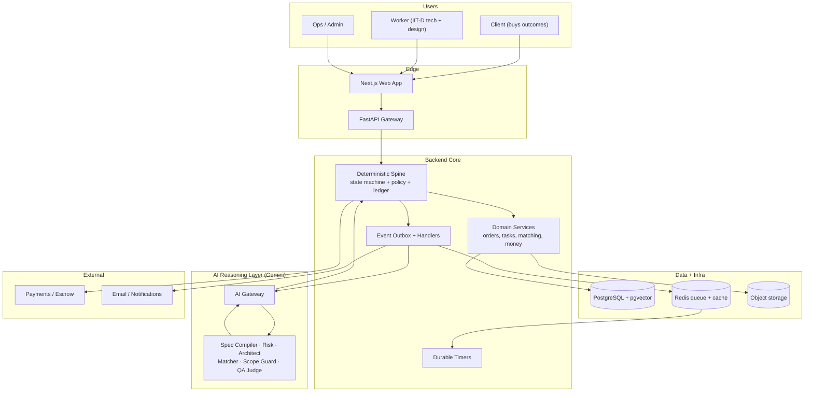
```mermaid
flowchart TB
    subgraph CLIENTS["Users"]
        C["Client (buys outcomes)"]
        W["Worker (IIT-D tech + design)"]
        OPS["Ops / Admin"]
    end

    subgraph EDGE["Edge"]
        WEB["Next.js Web App"]
        API["FastAPI Gateway"]
    end

    subgraph CORE["Backend Core"]
        SPINE["Deterministic Spine<br/>state machine + policy + ledger"]
        SVC["Domain Services<br/>orders, tasks, matching, money"]
        OUTBOX["Event Outbox + Handlers"]
        TIMERS["Durable Timers"]
    end

    subgraph AI["AI Reasoning Layer (Gemini)"]
        GATE["AI Gateway"]
        NODES["Spec Compiler · Risk · Architect<br/>Matcher · Scope Guard · QA Judge"]
    end

    subgraph DATA["Data + Infra"]
        PG[("PostgreSQL + pgvector")]
        REDIS[("Redis queue + cache")]
        BLOB[("Object storage")]
    end

    subgraph EXT["External"]
        PAY["Payments / Escrow"]
        MAIL["Email / Notifications"]
    end

    C --> WEB
    W --> WEB
    OPS --> WEB
    WEB --> API
    API --> SPINE
    SPINE --> SVC
    SVC --> PG
    SPINE --> OUTBOX
    OUTBOX --> REDIS
    REDIS --> TIMERS
    OUTBOX --> GATE
    GATE --> NODES
    NODES --> GATE
    GATE --> SPINE
    SVC --> BLOB
    SPINE --> PAY
    OUTBOX --> MAIL
```

## A2. Three-Layer Runtime

```mermaid
flowchart LR
    subgraph L1["Layer 1 — Deterministic Spine"]
        direction TB
        SM["State machine"]
        POL["Policy engine"]
        LED["Ledger"]
        AUD["Audit log"]
    end

    subgraph L2["Layer 2 — Domain Services"]
        direction TB
        ORD["Orders"]
        MATCH["Matching"]
        QAS["QA orchestration"]
        MON["Money"]
    end

    subgraph L3["Layer 3 — AI Reasoning Nodes"]
        direction TB
        SC["Spec Compiler"]
        ARC["Architect"]
        MR["Matcher"]
        QJ["QA Judge"]
    end

    L3 -->|"proposes (structured JSON)"| L1
    L1 -->|"validates + enforces"| L2
    L2 -->|"records facts"| L1
    L1 -->|"context for decisions"| L3
```

## A3. Spine + AI Reasoning Nodes (Propose vs Enforce)

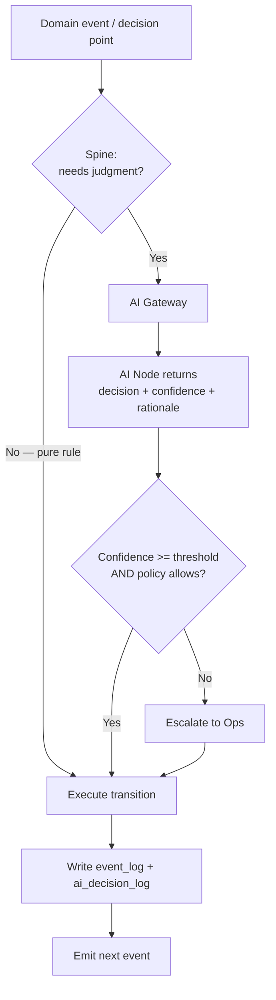
```mermaid
flowchart TB
    EV["Domain event / decision point"] --> SPINE{"Spine:<br/>needs judgment?"}
    SPINE -->|"No — pure rule"| EXEC["Execute transition"]
    SPINE -->|"Yes"| GATE["AI Gateway"]
    GATE --> NODE["AI Node returns<br/>decision + confidence + rationale"]
    NODE --> CONF{"Confidence >= threshold<br/>AND policy allows?"}
    CONF -->|"Yes"| EXEC
    CONF -->|"No"| HUMAN["Escalate to Ops"]
    HUMAN --> EXEC
    EXEC --> LOG["Write event_log + ai_decision_log"]
    LOG --> NEXT["Emit next event"]
```

## A4. Component "What Talks to What"

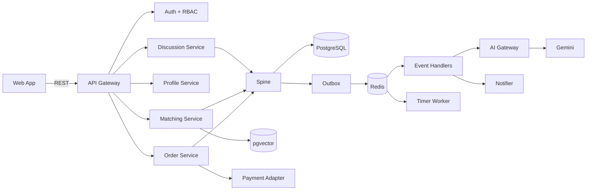
```mermaid
flowchart LR
    WEB["Web App"] -->|REST| API["API Gateway"]
    API --> AUTHZ["Auth + RBAC"]
    API --> ORD["Order Service"]
    API --> PRF["Profile Service"]
    API --> MATCH["Matching Service"]
    API --> CHAT["Discussion Service"]
    ORD --> SPINE["Spine"]
    MATCH --> SPINE
    CHAT --> SPINE
    SPINE --> DB[("PostgreSQL")]
    SPINE --> OUT["Outbox"]
    OUT --> Q[("Redis")]
    Q --> HAND["Event Handlers"]
    Q --> TMR["Timer Worker"]
    HAND --> AIG["AI Gateway"]
    HAND --> NOTIF["Notifier"]
    AIG --> GEM["Gemini"]
    MATCH --> VEC[("pgvector")]
    ORD --> PAY["Payment Adapter"]
```

## A5. Repository / Module Structure

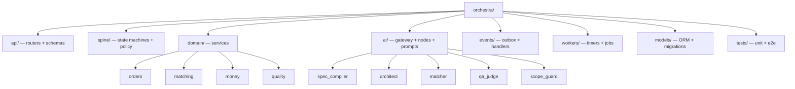
```mermaid
flowchart TB
    ROOT["orchestra/"]
    ROOT --> APIDIR["api/ — routers + schemas"]
    ROOT --> SPINEDIR["spine/ — state machines + policy"]
    ROOT --> DOMAIN["domain/ — services"]
    ROOT --> AIDIR["ai/ — gateway + nodes + prompts"]
    ROOT --> EVENTS["events/ — outbox + handlers"]
    ROOT --> WORKERS["workers/ — timers + jobs"]
    ROOT --> MODELS["models/ — ORM + migrations"]
    ROOT --> TESTS["tests/ — unit + e2e"]

    DOMAIN --> D1["orders"]
    DOMAIN --> D2["matching"]
    DOMAIN --> D3["money"]
    DOMAIN --> D4["quality"]
    AIDIR --> A1["spec_compiler"]
    AIDIR --> A2["architect"]
    AIDIR --> A3["matcher"]
    AIDIR --> A4["qa_judge"]
    AIDIR --> A5["scope_guard"]
```

## A6. Bounded Contexts (Domains)

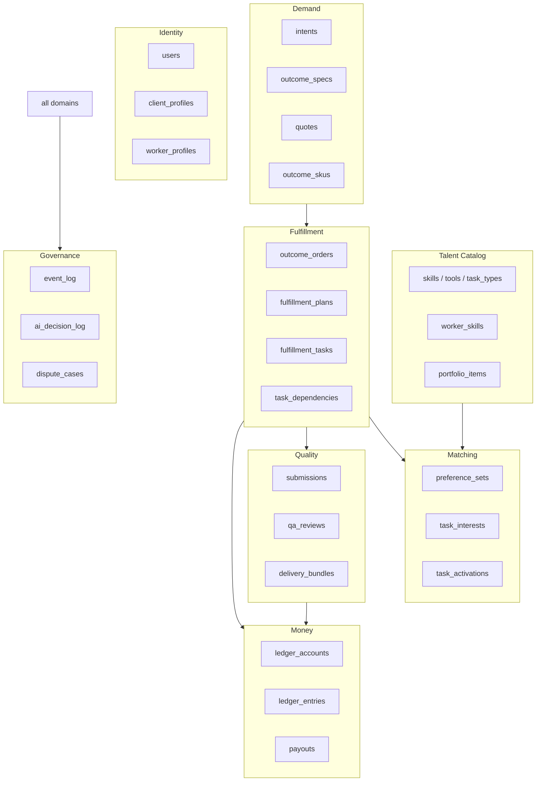
```mermaid
flowchart TB
    subgraph IDN["Identity"]
        U["users"]
        CP["client_profiles"]
        WP["worker_profiles"]
    end
    subgraph CAT["Talent Catalog"]
        SK["skills / tools / task_types"]
        WSK["worker_skills"]
        PORT["portfolio_items"]
    end
    subgraph DEM["Demand"]
        INT["intents"]
        SPEC["outcome_specs"]
        QUO["quotes"]
        SKU["outcome_skus"]
    end
    subgraph FUL["Fulfillment"]
        ORD["outcome_orders"]
        PLAN["fulfillment_plans"]
        TASK["fulfillment_tasks"]
        DEP["task_dependencies"]
    end
    subgraph MATCHD["Matching"]
        PS["preference_sets"]
        TI["task_interests"]
        TA["task_activations"]
    end
    subgraph QUAL["Quality"]
        SUB["submissions"]
        QAR["qa_reviews"]
        DB2["delivery_bundles"]
    end
    subgraph MONEY["Money"]
        LA["ledger_accounts"]
        LE["ledger_entries"]
        PO["payouts"]
    end
    subgraph GOV["Governance"]
        EVT["event_log"]
        AIL["ai_decision_log"]
        DISP["dispute_cases"]
    end

    DEM --> FUL
    CAT --> MATCHD
    FUL --> MATCHD
    FUL --> QUAL
    QUAL --> MONEY
    FUL --> MONEY
    ALLGOV["all domains"] --> GOV
```

## A7. Deployment / Infrastructure

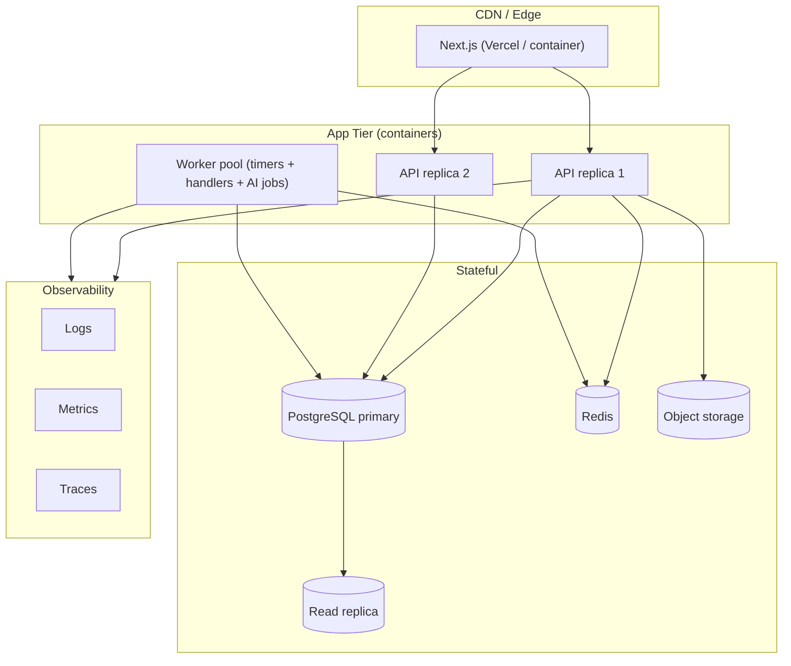
```mermaid
flowchart TB
    subgraph CDN["CDN / Edge"]
        NEXT["Next.js (Vercel / container)"]
    end
    subgraph APP["App Tier (containers)"]
        API1["API replica 1"]
        API2["API replica 2"]
        WRK["Worker pool (timers + handlers + AI jobs)"]
    end
    subgraph STATE["Stateful"]
        PG[("PostgreSQL primary")]
        PGR[("Read replica")]
        RDS[("Redis")]
        S3[("Object storage")]
    end
    subgraph OBS["Observability"]
        LOG["Logs"]
        MET["Metrics"]
        TRC["Traces"]
    end
    NEXT --> API1
    NEXT --> API2
    API1 --> PG
    API2 --> PG
    WRK --> PG
    API1 --> RDS
    WRK --> RDS
    API1 --> S3
    PG --> PGR
    API1 --> OBS
    WRK --> OBS
```

---

# B. Data Model

## B1. Full Entity-Relationship Model

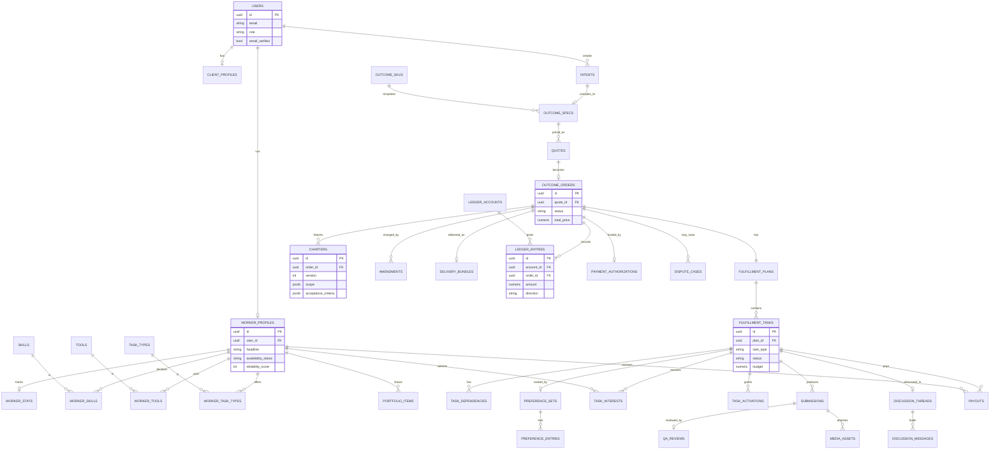
```mermaid
erDiagram
    USERS ||--o| CLIENT_PROFILES : has
    USERS ||--o| WORKER_PROFILES : has
    WORKER_PROFILES ||--o| WORKER_STATS : tracks
    WORKER_PROFILES ||--o{ WORKER_SKILLS : declares
    WORKER_PROFILES ||--o{ WORKER_TOOLS : uses
    WORKER_PROFILES ||--o{ WORKER_TASK_TYPES : offers
    WORKER_PROFILES ||--o{ PORTFOLIO_ITEMS : shows
    SKILLS ||--o{ WORKER_SKILLS : in
    TOOLS ||--o{ WORKER_TOOLS : in
    TASK_TYPES ||--o{ WORKER_TASK_TYPES : in

    USERS ||--o{ INTENTS : creates
    INTENTS ||--o| OUTCOME_SPECS : compiles_to
    OUTCOME_SKUS ||--o{ OUTCOME_SPECS : templates
    OUTCOME_SPECS ||--o{ QUOTES : priced_as
    QUOTES ||--o| OUTCOME_ORDERS : becomes
    OUTCOME_ORDERS ||--|| FULFILLMENT_PLANS : has
    OUTCOME_ORDERS ||--o{ CHARTERS : freezes
    OUTCOME_ORDERS ||--o{ AMENDMENTS : changed_by
    OUTCOME_ORDERS ||--o| DELIVERY_BUNDLES : delivered_as
    OUTCOME_ORDERS ||--o{ LEDGER_ENTRIES : records
    OUTCOME_ORDERS ||--o| PAYMENT_AUTHORIZATIONS : funded_by
    OUTCOME_ORDERS ||--o{ DISPUTE_CASES : may_raise

    FULFILLMENT_PLANS ||--o{ FULFILLMENT_TASKS : contains
    FULFILLMENT_TASKS ||--o{ TASK_DEPENDENCIES : has
    FULFILLMENT_TASKS ||--o| PREFERENCE_SETS : ranked_by
    PREFERENCE_SETS ||--o{ PREFERENCE_ENTRIES : lists
    FULFILLMENT_TASKS ||--o{ TASK_INTERESTS : receives
    FULFILLMENT_TASKS ||--o{ TASK_ACTIVATIONS : grants
    FULFILLMENT_TASKS ||--o{ SUBMISSIONS : produces
    SUBMISSIONS ||--o| QA_REVIEWS : reviewed_by
    FULFILLMENT_TASKS ||--o| DISCUSSION_THREADS : discussed_in
    DISCUSSION_THREADS ||--o{ DISCUSSION_MESSAGES : holds
    FULFILLMENT_TASKS ||--o{ PAYOUTS : pays
    WORKER_PROFILES ||--o{ TASK_INTERESTS : submits
    WORKER_PROFILES ||--o{ PAYOUTS : receives

    LEDGER_ACCOUNTS ||--o{ LEDGER_ENTRIES : posts
    SUBMISSIONS ||--o{ MEDIA_ASSETS : attaches

    USERS {
        uuid id PK
        string email
        string role
        bool email_verified
    }
    WORKER_PROFILES {
        uuid id PK
        uuid user_id FK
        string headline
        string availability_status
        int reliability_score
    }
    OUTCOME_ORDERS {
        uuid id PK
        uuid quote_id FK
        string status
        numeric total_price
    }
    FULFILLMENT_TASKS {
        uuid id PK
        uuid plan_id FK
        string task_type
        string status
        numeric budget
    }
    CHARTERS {
        uuid id PK
        uuid order_id FK
        int version
        jsonb scope
        jsonb acceptance_criteria
    }
    LEDGER_ENTRIES {
        uuid id PK
        uuid account_id FK
        uuid order_id FK
        numeric amount
        string direction
    }
```

## B2. Core Domain Class Model

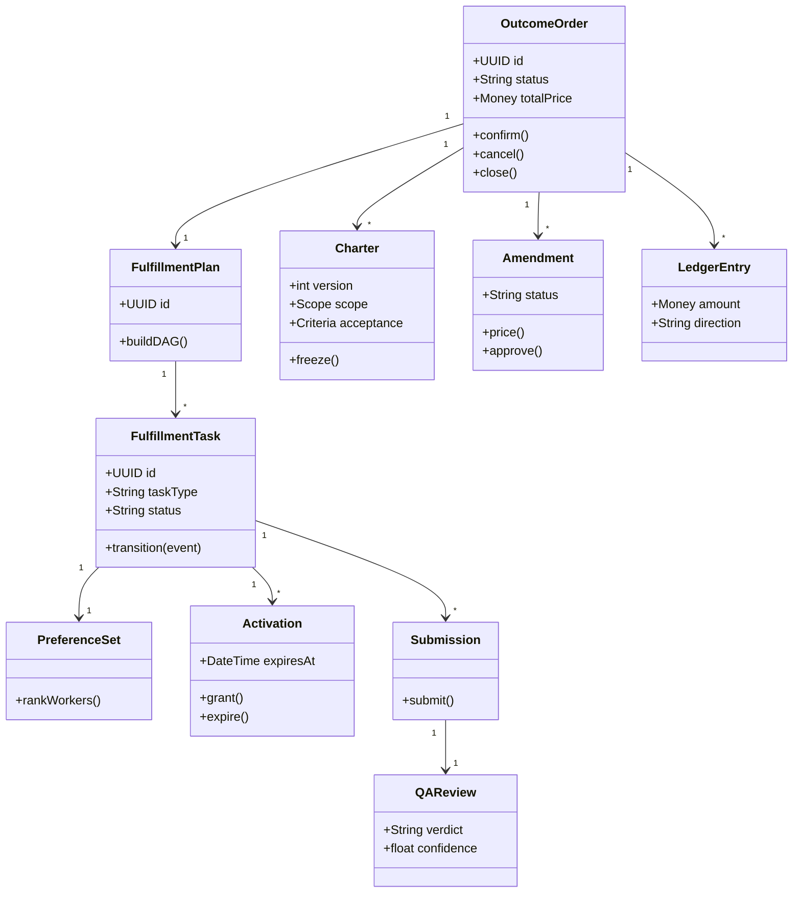
```mermaid
classDiagram
    class OutcomeOrder {
        +UUID id
        +String status
        +Money totalPrice
        +confirm()
        +cancel()
        +close()
    }
    class FulfillmentPlan {
        +UUID id
        +buildDAG()
    }
    class FulfillmentTask {
        +UUID id
        +String taskType
        +String status
        +transition(event)
    }
    class Charter {
        +int version
        +Scope scope
        +Criteria acceptance
        +freeze()
    }
    class Amendment {
        +String status
        +price()
        +approve()
    }
    class PreferenceSet {
        +rankWorkers()
    }
    class Activation {
        +DateTime expiresAt
        +grant()
        +expire()
    }
    class Submission {
        +submit()
    }
    class QAReview {
        +String verdict
        +float confidence
    }
    class LedgerEntry {
        +Money amount
        +String direction
    }

    OutcomeOrder "1" --> "1" FulfillmentPlan
    OutcomeOrder "1" --> "*" Charter
    OutcomeOrder "1" --> "*" Amendment
    FulfillmentPlan "1" --> "*" FulfillmentTask
    FulfillmentTask "1" --> "1" PreferenceSet
    FulfillmentTask "1" --> "*" Activation
    FulfillmentTask "1" --> "*" Submission
    Submission "1" --> "1" QAReview
    OutcomeOrder "1" --> "*" LedgerEntry
```

---

# C. State Machines

## C1. Outcome Order Lifecycle

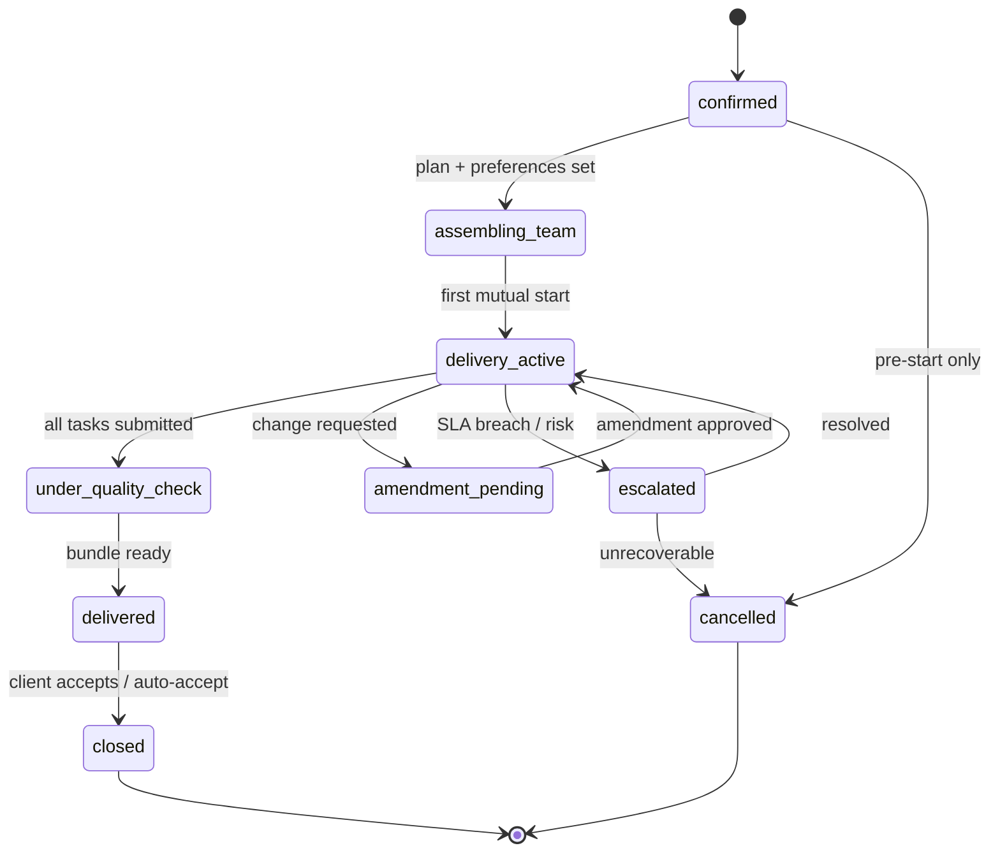
```mermaid
stateDiagram-v2
    [*] --> confirmed
    confirmed --> assembling_team: plan + preferences set
    confirmed --> cancelled: pre-start only
    assembling_team --> delivery_active: first mutual start
    delivery_active --> under_quality_check: all tasks submitted
    delivery_active --> amendment_pending: change requested
    amendment_pending --> delivery_active: amendment approved
    delivery_active --> escalated: SLA breach / risk
    escalated --> delivery_active: resolved
    escalated --> cancelled: unrecoverable
    under_quality_check --> delivered: bundle ready
    delivered --> closed: client accepts / auto-accept
    closed --> [*]
    cancelled --> [*]
```

## C2. Fulfillment Task Lifecycle

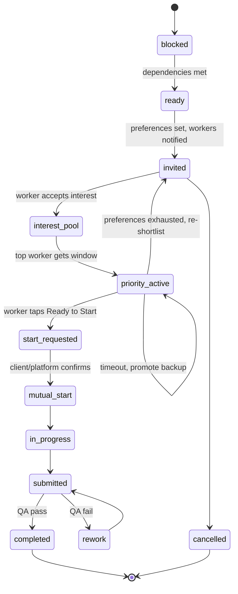
```mermaid
stateDiagram-v2
    [*] --> blocked
    blocked --> ready: dependencies met
    ready --> invited: preferences set, workers notified
    invited --> interest_pool: worker accepts interest
    interest_pool --> priority_active: top worker gets window
    priority_active --> priority_active: timeout, promote backup
    priority_active --> invited: preferences exhausted, re-shortlist
    priority_active --> start_requested: worker taps Ready to Start
    start_requested --> mutual_start: client/platform confirms
    mutual_start --> in_progress
    in_progress --> submitted
    submitted --> completed: QA pass
    submitted --> rework: QA fail
    rework --> submitted
    completed --> [*]
    invited --> cancelled
    cancelled --> [*]
```

## C3. Worker-Per-Task (Interest / Priority)

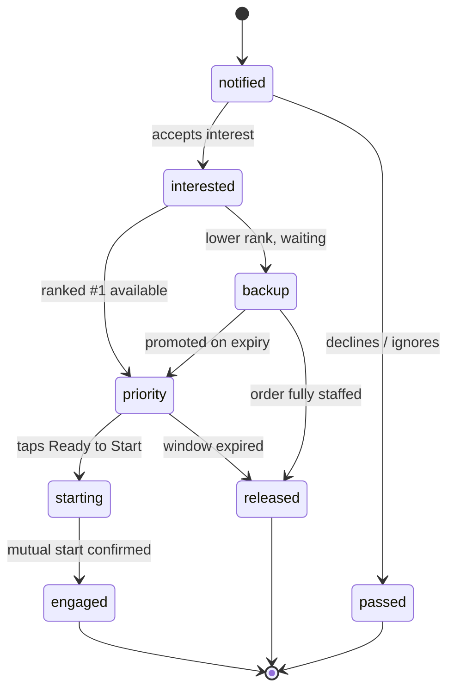
```mermaid
stateDiagram-v2
    [*] --> notified
    notified --> interested: accepts interest
    notified --> passed: declines / ignores
    interested --> priority: ranked #1 available
    interested --> backup: lower rank, waiting
    priority --> starting: taps Ready to Start
    priority --> released: window expired
    backup --> priority: promoted on expiry
    backup --> released: order fully staffed
    starting --> engaged: mutual start confirmed
    engaged --> [*]
    released --> [*]
    passed --> [*]
```

## C4. Quote Lifecycle

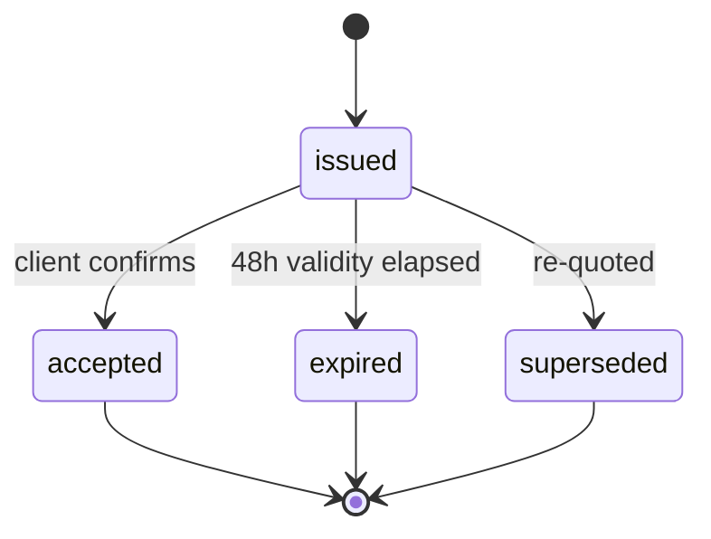
```mermaid
stateDiagram-v2
    [*] --> issued
    issued --> accepted: client confirms
    issued --> expired: 48h validity elapsed
    issued --> superseded: re-quoted
    accepted --> [*]
    expired --> [*]
    superseded --> [*]
```

## C5. Charter + Amendment Lifecycle

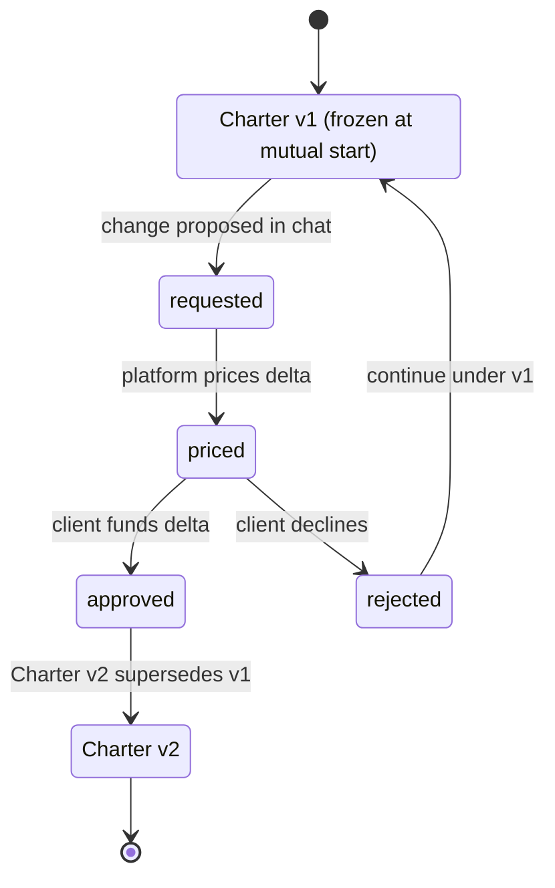
```mermaid
stateDiagram-v2
    state "Charter v1 (frozen at mutual start)" as V1
    [*] --> V1
    V1 --> requested: change proposed in chat
    requested --> priced: platform prices delta
    priced --> approved: client funds delta
    priced --> rejected: client declines
    approved --> V2: Charter v2 supersedes v1
    rejected --> V1: continue under v1
    state "Charter v2" as V2
    V2 --> [*]
```

## C6. Money / Ledger Reservation

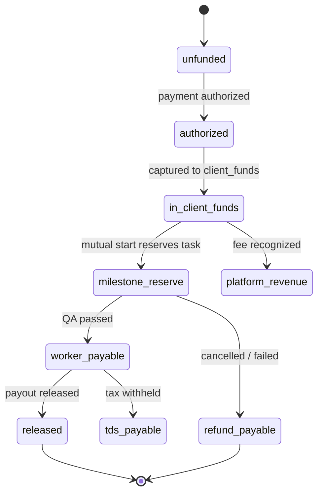
```mermaid
stateDiagram-v2
    [*] --> unfunded
    unfunded --> authorized: payment authorized
    authorized --> in_client_funds: captured to client_funds
    in_client_funds --> milestone_reserve: mutual start reserves task
    milestone_reserve --> worker_payable: QA passed
    milestone_reserve --> refund_payable: cancelled / failed
    worker_payable --> released: payout released
    in_client_funds --> platform_revenue: fee recognized
    worker_payable --> tds_payable: tax withheld
    released --> [*]
    refund_payable --> [*]
```

## C7. Payout Lifecycle

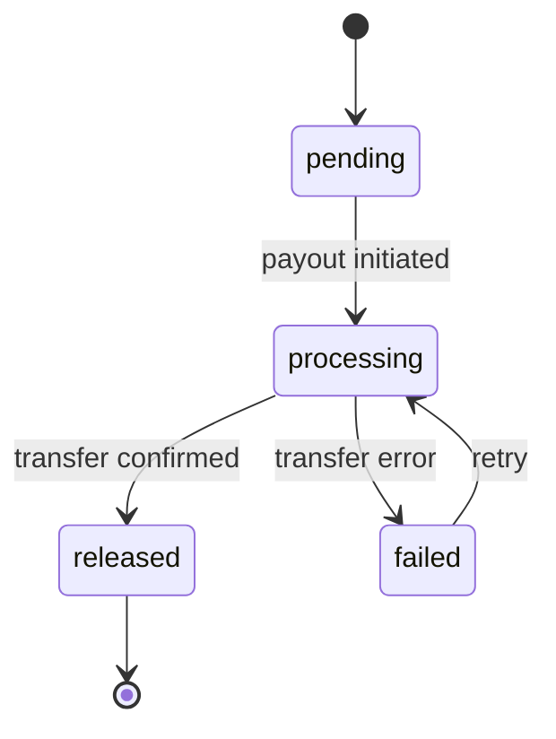
```mermaid
stateDiagram-v2
    [*] --> pending
    pending --> processing: payout initiated
    processing --> released: transfer confirmed
    processing --> failed: transfer error
    failed --> processing: retry
    released --> [*]
```

## C8. Dispute Lifecycle

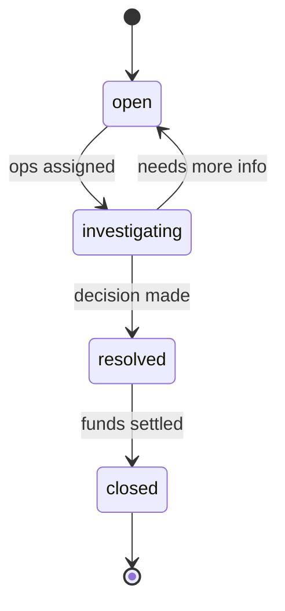
```mermaid
stateDiagram-v2
    [*] --> open
    open --> investigating: ops assigned
    investigating --> resolved: decision made
    resolved --> closed: funds settled
    investigating --> open: needs more info
    closed --> [*]
```

---

# D. Sequence Diagrams

## D1. Client Intent to Confirmed Order

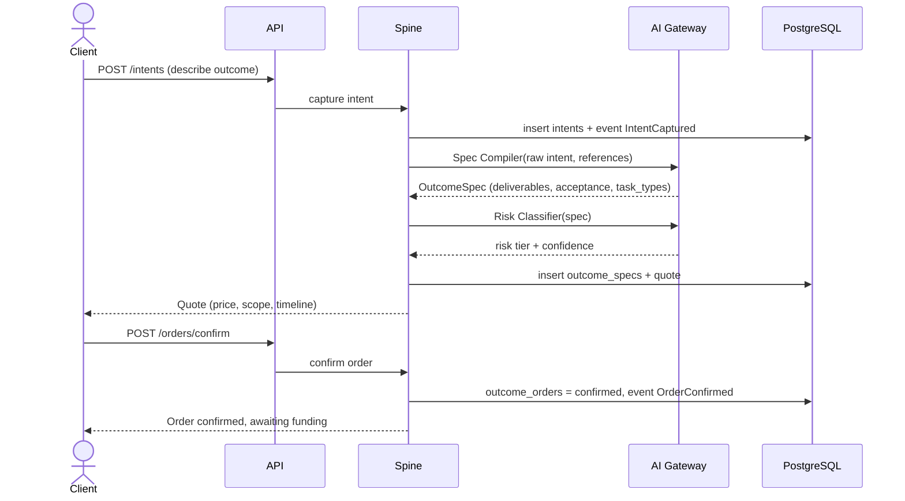
```mermaid
sequenceDiagram
    actor C as Client
    participant API
    participant Spine
    participant AI as AI Gateway
    participant DB as PostgreSQL

    C->>API: POST /intents (describe outcome)
    API->>Spine: capture intent
    Spine->>DB: insert intents + event IntentCaptured
    Spine->>AI: Spec Compiler(raw intent, references)
    AI-->>Spine: OutcomeSpec (deliverables, acceptance, task_types)
    Spine->>AI: Risk Classifier(spec)
    AI-->>Spine: risk tier + confidence
    Spine->>DB: insert outcome_specs + quote
    Spine-->>C: Quote (price, scope, timeline)
    C->>API: POST /orders/confirm
    API->>Spine: confirm order
    Spine->>DB: outcome_orders = confirmed, event OrderConfirmed
    Spine-->>C: Order confirmed, awaiting funding
```

## D2. Worker Onboarding

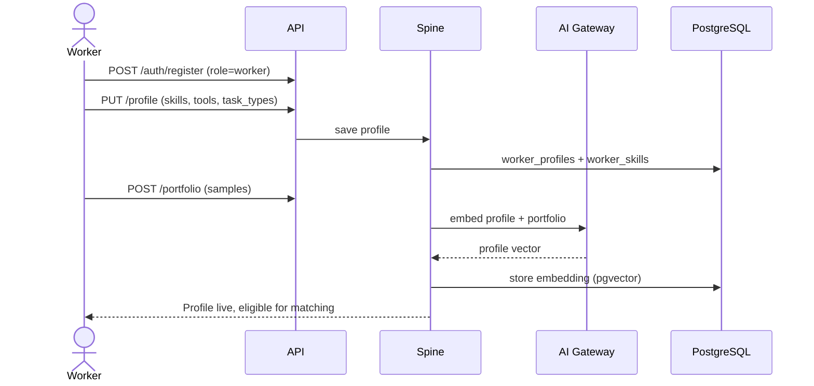
```mermaid
sequenceDiagram
    actor W as Worker
    participant API
    participant Spine
    participant AI as AI Gateway
    participant DB as PostgreSQL

    W->>API: POST /auth/register (role=worker)
    W->>API: PUT /profile (skills, tools, task_types)
    API->>Spine: save profile
    Spine->>DB: worker_profiles + worker_skills
    W->>API: POST /portfolio (samples)
    Spine->>AI: embed profile + portfolio
    AI-->>Spine: profile vector
    Spine->>DB: store embedding (pgvector)
    Spine-->>W: Profile live, eligible for matching
```

## D3. Preference Cascade + Mutual Start

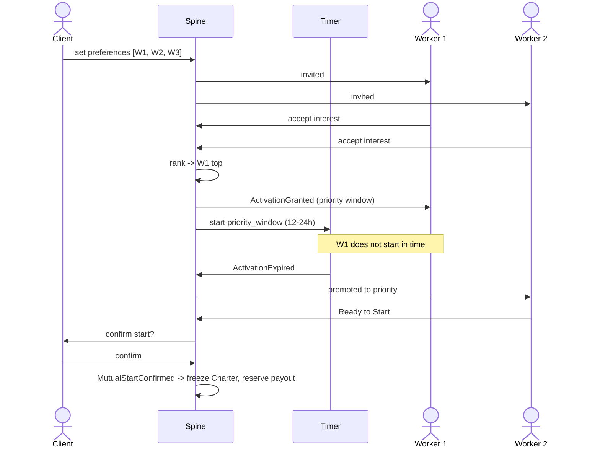
```mermaid
sequenceDiagram
    actor C as Client
    participant Spine
    participant Timer
    actor W1 as Worker 1
    actor W2 as Worker 2

    C->>Spine: set preferences [W1, W2, W3]
    Spine->>W1: invited
    Spine->>W2: invited
    W1->>Spine: accept interest
    W2->>Spine: accept interest
    Spine->>Spine: rank -> W1 top
    Spine->>W1: ActivationGranted (priority window)
    Spine->>Timer: start priority_window (12-24h)
    Note over W1,Timer: W1 does not start in time
    Timer->>Spine: ActivationExpired
    Spine->>W2: promoted to priority
    W2->>Spine: Ready to Start
    Spine->>C: confirm start?
    C->>Spine: confirm
    Spine->>Spine: MutualStartConfirmed -> freeze Charter, reserve payout
```

## D4. Task Execution + QA Loop

```mermaid
sequenceDiagram
    actor W as Worker
    participant API
    participant Spine
    participant AI as QA Judge
    participant DET as Deterministic Checks
    actor C as Client

    W->>API: POST /submissions (deliverable)
    API->>Spine: SubmissionReceived
    Spine->>DET: run rule checks (formats, lighthouse, tests)
    DET-->>Spine: pass/fail per rule
    Spine->>AI: QA Judge(deliverable, criteria)
    AI-->>Spine: verdict + confidence + notes
    alt pass and confident
        Spine->>Spine: QualityPassed -> payout, unlock deps
        Spine-->>C: deliverable ready
    else fail
        Spine-->>W: rework with reasons
        W->>API: resubmit
    end
```

## D5. Full Journey Through Spine + AI

```mermaid
sequenceDiagram
    actor C as Client
    participant Spine
    participant AI as AI Gateway
    actor W as Worker
    participant Money as Ledger

    C->>Spine: intent
    Spine->>AI: Spec Compiler + Risk
    AI-->>Spine: spec + risk
    Spine-->>C: quote
    C->>Spine: confirm + fund
    Spine->>Money: capture to client_funds
    Spine->>AI: Architect (build DAG)
    AI-->>Spine: fulfillment plan (tasks)
    Spine->>AI: Matcher (shortlist per task)
    AI-->>Spine: ranked workers
    Spine->>W: invite -> interest -> priority
    W->>Spine: Ready to Start
    C->>Spine: confirm start
    Spine->>Money: reserve milestone
    W->>Spine: submit
    Spine->>AI: QA Judge
    AI-->>Spine: pass
    Spine->>Money: worker_payable + tds
    Spine-->>C: deliver bundle
    C->>Spine: accept
    Spine->>Money: release payouts + platform_revenue
```

## D6. AI Gateway Call Pattern

```mermaid
sequenceDiagram
    participant H as Event Handler
    participant G as AI Gateway
    participant P as Prompt Builder
    participant M as Gemini
    participant V as Schema Validator
    participant L as ai_decision_log

    H->>G: run(node, context)
    G->>P: build prompt + schema
    P-->>G: prompt
    G->>M: structured output request
    M-->>G: JSON candidate
    G->>V: validate against schema
    alt valid
        V-->>G: ok
        G->>L: log decision + confidence
        G-->>H: decision
    else invalid
        V-->>G: error
        G->>M: retry with correction
        M-->>G: JSON
        G-->>H: decision or escalate
    end
```

## D7. Transactional Outbox Propagation

```mermaid
sequenceDiagram
    participant S as Service (in txn)
    participant DB as PostgreSQL
    participant OB as Outbox Worker
    participant Q as Redis
    participant H as Handlers

    S->>DB: BEGIN
    S->>DB: write domain rows
    S->>DB: insert event_log row
    S->>DB: COMMIT
    OB->>DB: poll unpublished events
    DB-->>OB: event batch
    OB->>Q: publish
    Q->>H: deliver
    H->>H: side effects (notify, timer, AI job)
    H->>DB: mark published
```

---

# E. Process Flows

## E1. Master End-to-End

```mermaid
flowchart TD
    A["Client describes outcome"] --> B["Spec Compiler -> OutcomeSpec"]
    B --> C["Risk Classifier -> tier"]
    C --> D["Quote issued"]
    D --> E{"Client confirms?"}
    E -->|No| X["Expire / revise"]
    E -->|Yes| F["Fund escrow"]
    F --> G["Architect -> task DAG"]
    G --> H["Matcher -> shortlist per task"]
    H --> I["Client sets preferences"]
    I --> J["Preference cascade -> priority worker"]
    J --> K["Mutual start -> Charter frozen"]
    K --> L["Execution + discussion (scope-guarded)"]
    L --> M["Submission"]
    M --> N{"QA pass?"}
    N -->|No| L
    N -->|Yes| O["Unlock dependents / assemble bundle"]
    O --> P{"All tasks done?"}
    P -->|No| H
    P -->|Yes| Q["Deliver bundle"]
    Q --> R["Client accepts / auto-accept"]
    R --> S["Release payouts + fees + RAG ingest"]
```

## E2. Client Journey

```mermaid
flowchart LR
    A["Describe"] --> B["Review quote + scope"]
    B --> C["Confirm + fund"]
    C --> D["Pick preferred workers"]
    D --> E["Confirm start"]
    E --> F["Track progress + chat"]
    F --> G["Review deliverables"]
    G --> H{"Accept?"}
    H -->|Yes| I["Closed"]
    H -->|No| J["Request rework / amendment"]
    J --> F
```

## E3. Worker Journey

```mermaid
flowchart LR
    A["Build profile"] --> B["Get matched"]
    B --> C["Show interest"]
    C --> D{"Priority granted?"}
    D -->|No| E["Wait as backup"]
    E --> D
    D -->|Yes| F["Ready to Start"]
    F --> G["Mutual start"]
    G --> H["Execute"]
    H --> I["Submit"]
    I --> J{"QA pass?"}
    J -->|No| H
    J -->|Yes| K["Get paid + reputation up"]
```

## E4. Matching Pipeline

```mermaid
flowchart TD
    T["Task + Charter"] --> ELIG["Filter: eligible + available + skill match"]
    ELIG --> EMB["Embed task requirements"]
    EMB --> RET["Vector retrieve top-N workers"]
    RET --> RANK["Matcher rerank (fit + reliability + load)"]
    RANK --> RAT["Attach rationale"]
    RAT --> SHORT["Shortlist to client"]
    SHORT --> PREF["Client ranks preferences"]
```

## E5. QA Judge Decision

```mermaid
flowchart TD
    S["Submission"] --> DET{"Deterministic checks pass?"}
    DET -->|No| FAIL["Fail -> rework with reasons"]
    DET -->|Yes| RISK{"Production software / high risk?"}
    RISK -->|Yes| HUMAN["Human approver required"]
    RISK -->|No| AIJ["QA Judge scores rubric"]
    AIJ --> CONF{"Confidence high + pass?"}
    CONF -->|Yes| PASS["Pass -> payout + unlock"]
    CONF -->|No| HUMAN
    HUMAN --> DEC{"Approve?"}
    DEC -->|Yes| PASS
    DEC -->|No| FAIL
```

## E6. Confidence-Gated Autonomy

```mermaid
flowchart TD
    D["AI decision + confidence"] --> P{"Policy allows autonomy here?"}
    P -->|No| ESC["Escalate to Ops"]
    P -->|Yes| C{"Confidence >= threshold?"}
    C -->|Yes| AUTO["Auto-execute"]
    C -->|No| ESC
    ESC --> OPS{"Ops decision"}
    OPS -->|Approve| AUTO
    OPS -->|Override| MANUAL["Manual action recorded"]
    AUTO --> LOG["Log to ai_decision_log"]
    MANUAL --> LOG
```

## E7. Scope Control in Discussion

```mermaid
flowchart TD
    M["New chat message"] --> SG["Scope Guard classifies"]
    SG --> T{"Type?"}
    T -->|Clarification| OK["Allowed, continue work"]
    T -->|Scope change| FLAG["Flag: outside Charter"]
    FLAG --> PROP["Propose Amendment"]
    PROP --> CL{"Client funds delta?"}
    CL -->|Yes| NEWC["Charter v+1, replan"]
    CL -->|No| HOLD["Stay in current scope"]
    OK --> WORK["Work continues"]
    NEWC --> WORK
    HOLD --> WORK
```

## E8. Preference Activation Logic

```mermaid
flowchart TD
    PS["PreferenceSet ranked"] --> INV["Invite all preferred"]
    INV --> POOL["Collect accepted interests"]
    POOL --> TOP{"Top-ranked available accepted?"}
    TOP -->|Yes| ACT["Grant priority window"]
    TOP -->|No| NEXT["Next rank"]
    NEXT --> ACT
    ACT --> START{"Started before expiry?"}
    START -->|Yes| MS["Mutual start"]
    START -->|No| PROMO{"Backup available?"}
    PROMO -->|Yes| ACT
    PROMO -->|No| RESHORT["Re-shortlist via Matcher"]
    RESHORT --> INV
```

## E9. Dual-View (One Task, Two Languages)

```mermaid
flowchart LR
    subgraph SYS["System state (task)"]
        S1["invited"] --> S2["interest_pool"] --> S3["priority_active"] --> S4["mutual_start"] --> S5["in_progress"] --> S6["submitted"] --> S7["completed"]
    end
    subgraph CV["Client sees"]
        C1["Finding your team"] --> C2["Team forming"] --> C3["Starting soon"] --> C4["Work started"] --> C5["In progress"] --> C6["In review"] --> C7["Delivered"]
    end
    subgraph WV["Worker sees"]
        W1["You're invited"] --> W2["Interest received"] --> W3["You have priority"] --> W4["Start confirmed"] --> W5["Deliver now"] --> W6["Under QA"] --> W7["Paid"]
    end
    S3 -.-> C3
    S3 -.-> W3
```

## E10. Data Flywheel

```mermaid
flowchart LR
    RUN["Completed outcomes"] --> SIG["Signals: effort, QA verdicts, match results, disputes"]
    SIG --> STORE["Store + label"]
    STORE --> TUNE["Tune estimators, rubrics, matcher weights"]
    TUNE --> BETTER["Better quotes, matches, QA"]
    BETTER --> MORE["More successful outcomes"]
    MORE --> RUN
```

---

# F. Events

## F1. Event Chain

```mermaid
flowchart TD
    IC["IntentCaptured"] --> SCd["SpecCompiled"]
    SCd --> QI["QuoteIssued"]
    QI --> OC["OrderConfirmed"]
    OC --> FA["FundsAuthorized"]
    FA --> PA["PlanApproved"]
    PA --> PSet["PreferencesSet"]
    PSet --> IA["InterestAccepted"]
    IA --> AG["ActivationGranted"]
    AG --> AE["ActivationExpired"]
    AE --> AG
    AG --> MS["MutualStartConfirmed"]
    MS --> SR["SubmissionReceived"]
    SR --> QP["QualityPassed"]
    SR --> QF["QualityFailed"]
    QF --> SR
    QP --> OClose["OutcomeClosed"]
    MS --> AA["AmendmentApproved"]
    AA --> MS
```

## F2. Event Producers and Consumers

```mermaid
flowchart LR
    subgraph PROD["Producers"]
        P1["Intent API"]
        P2["AI Gateway"]
        P3["Order API"]
        P4["Payment webhook"]
        P5["Worker API"]
        P6["Timer job"]
        P7["Submit API"]
        P8["QA service"]
    end
    subgraph BUS["Event Bus (outbox -> Redis)"]
        E["event_log"]
    end
    subgraph CONS["Consumers"]
        C1["Spec Compiler job"]
        C2["Quote flow"]
        C3["Plan builder"]
        C4["Priority logic"]
        C5["Timer worker"]
        C6["Charter freeze + ledger"]
        C7["QA Judge job"]
        C8["Payout + notify"]
        C9["RAG ingest"]
    end
    P1 --> E
    P2 --> E
    P3 --> E
    P4 --> E
    P5 --> E
    P6 --> E
    P7 --> E
    P8 --> E
    E --> C1
    E --> C2
    E --> C3
    E --> C4
    E --> C5
    E --> C6
    E --> C7
    E --> C8
    E --> C9
```

---

# G. Business & GTM

## G1. User Roles

```mermaid
flowchart TB
    ROOT["Platform users"] --> CLI["Client"]
    ROOT --> WRK["Worker"]
    ROOT --> OPS["Ops / Admin"]
    CLI --> CL1["Describe outcome"]
    CLI --> CL2["Fund + set preferences"]
    CLI --> CL3["Accept deliverables"]
    WRK --> WK1["Build profile"]
    WRK --> WK2["Accept + deliver tasks"]
    WRK --> WK3["Get paid + reputation"]
    OPS --> OP1["Handle escalations"]
    OPS --> OP2["Resolve disputes"]
    OPS --> OP3["Approve high-risk QA"]
```

## G2. Risk Tiers L0–L3

```mermaid
flowchart LR
    L0["L0 — Trivial<br/>full autonomy"] --> L1["L1 — Standard<br/>autonomy + spot checks"]
    L1 --> L2["L2 — Sensitive<br/>human approver on QA"]
    L2 --> L3["L3 — Critical / production<br/>mandatory human sign-off"]
    L0 -.->|"logo, simple asset"| EX0["examples"]
    L1 -.->|"landing page"| EX1["examples"]
    L2 -.->|"brand system, integrations"| EX2["examples"]
    L3 -.->|"payment code, prod deploy"| EX3["examples"]
```

## G3. Money Flow / Business Model

```mermaid
flowchart TD
    CP["Client pays outcome price"] --> ESC["Escrow: client_funds"]
    ESC --> RES["milestone_reserve (per task at mutual start)"]
    RES --> QAOK{"QA passed?"}
    QAOK -->|Yes| WP["worker_payable"]
    QAOK -->|No| REF["refund_payable"]
    WP --> TDS["tds_payable (tax withheld)"]
    WP --> PAYOUT["Worker payout released"]
    ESC --> REV["platform_revenue (margin/fee)"]
    ESC --> RR["risk_reserve (buffer)"]
```

## G4. GTM Phases with Promotion Gates

```mermaid
flowchart LR
    P0["Phase 0<br/>Concierge (manual ops)"] --> G0{"Reliability + NPS gate"}
    G0 -->|pass| P1["Phase 1<br/>Assisted autonomy"]
    P1 --> G1{"Autonomy rate + QA gate"}
    G1 -->|pass| P2["Phase 2<br/>Self-serve SKUs"]
    P2 --> G2{"Unit economics gate"}
    G2 -->|pass| P3["Phase 3<br/>Scale + new verticals"]
    G0 -->|fail| P0
    G1 -->|fail| P1
    G2 -->|fail| P2
```

## G5. Client Experience (Journey)

```mermaid
journey
    title Client Experience
    section Discover
      Describe outcome: 4: Client
      Review quote: 4: Client
    section Commit
      Confirm and fund: 3: Client
      Pick preferred workers: 5: Client
      Confirm start: 4: Client
    section Delivery
      Track progress: 4: Client
      Chat within scope: 3: Client
      Review deliverables: 5: Client
    section Close
      Accept outcome: 5: Client
```

## G6. Worker Experience (Journey)

```mermaid
journey
    title Worker Experience
    section Setup
      Build profile: 3: Worker
      Add portfolio: 4: Worker
    section Get work
      Receive invite: 5: Worker
      Accept interest: 5: Worker
      Get priority: 4: Worker
    section Deliver
      Mutual start: 4: Worker
      Do the work: 3: Worker
      Submit: 4: Worker
    section Reward
      Pass QA: 4: Worker
      Get paid: 5: Worker
```

## G7. Competitive Positioning

```mermaid
quadrantChart
    title Automation vs Outcome Guarantee
    x-axis Low Automation --> High Automation
    y-axis Sells Effort --> Guarantees Outcome
    quadrant-1 Autonomous outcome studio
    quadrant-2 Managed agencies
    quadrant-3 Classic freelance boards
    quadrant-4 AI tools (no guarantee)
    Upwork: [0.25, 0.2]
    Fiverr: [0.35, 0.35]
    Traditional agency: [0.15, 0.75]
    Generic AI tools: [0.8, 0.25]
    Project Orchestra: [0.82, 0.82]
```

## G8. Unit Economics Split (Illustrative)

```mermaid
pie showData
    title Where the outcome price goes
    "Worker payouts" : 60
    "Platform margin" : 22
    "Payment + infra" : 8
    "Risk reserve" : 6
    "TDS / compliance" : 4
```

## G9. Money Split (Sankey)

```mermaid
sankey-beta

Client Price,Escrow,10000
Escrow,Worker Payouts,6000
Escrow,Platform Margin,2200
Escrow,Payment and Infra,800
Escrow,Risk Reserve,600
Escrow,TDS Compliance,400
```

---

# H. Roadmap & Implementation

## H1. Product Roadmap (Timeline)

```mermaid
timeline
    title Project Orchestra Roadmap
    section Phase 0 — Foundation
        Backend prototype : Spine + state machines : Vertical slice one task
    section Phase 1 — Assisted Autonomy
        Spec Compiler + Matcher : QA Judge + Scope Guard : Web app MVP
    section Phase 2 — Self-Serve
        Outcome SKUs : Payments + payouts : Reputation + flywheel
    section Phase 3 — Scale
        New task types : Multi-vertical : Autonomy expansion
```

## H2. Build Phases (Gantt)

```mermaid
gantt
    title Build Phases
    dateFormat YYYY-MM-DD
    axisFormat %b

    section Phase 0 Backend
    Data model + migrations   :p0a, 2026-01-01, 14d
    Spine + state machines    :p0b, after p0a, 14d
    Outbox + timers           :p0c, after p0b, 10d
    Vertical slice e2e        :p0d, after p0c, 10d

    section Phase 1 AI + API
    AI gateway + Spec Compiler :p1a, after p0d, 14d
    Matcher + embeddings       :p1b, after p1a, 14d
    QA Judge + Scope Guard     :p1c, after p1b, 14d
    Web MVP                    :p1d, after p1a, 28d

    section Phase 2 Money
    Payments + escrow          :p2a, after p1c, 14d
    Payouts + ledger           :p2b, after p2a, 14d
    Reputation + flywheel      :p2c, after p2b, 14d
```

## H3. Parallel Workstreams (Gantt)

```mermaid
gantt
    title Parallel Workstreams (after backend core)
    dateFormat YYYY-MM-DD
    axisFormat %b

    section Backend
    Core services      :b1, 2026-02-01, 30d
    Event handlers     :b2, after b1, 20d

    section AI
    Nodes + prompts    :a1, 2026-02-10, 30d
    Eval harness       :a2, after a1, 15d

    section Frontend
    Client app         :f1, 2026-02-15, 35d
    Worker app         :f2, after f1, 25d

    section Ops
    Admin console      :o1, 2026-03-01, 25d
    Observability      :o2, 2026-02-20, 20d
```

## H4. Piece Dependency Map

```mermaid
flowchart TD
    P1["1. Data model"] --> P2["2. Spine + state machines"]
    P2 --> P3["3. Outbox + timers"]
    P3 --> P4["4. Vertical slice (one task e2e)"]
    P4 --> P5["5. AI gateway + Spec Compiler"]
    P5 --> P6["6. Architect (DAG)"]
    P5 --> P7["7. Matcher + embeddings"]
    P4 --> P8["8. Preference + activation"]
    P7 --> P8
    P4 --> P9["9. Submission + QA Judge"]
    P9 --> P10["10. Money: escrow + ledger + payouts"]
    P6 --> P11["11. Web app MVP"]
    P8 --> P11
    P9 --> P11
    P10 --> P12["12. Disputes + admin + observability"]
```

## H5. Backend-First Sequence

```mermaid
flowchart LR
    A["Contracts first<br/>schemas + OpenAPI"] --> B["DB + migrations"]
    B --> C["Spine + policies"]
    C --> D["Services + outbox"]
    D --> E["Prove vertical slice via tests"]
    E --> F["Add AI nodes behind gateway"]
    F --> G["Add money + payouts"]
    G --> H["Then build UI on stable API"]
```

## H6. Fundraising Milestones (Timeline)

```mermaid
timeline
    title Fundraising Milestones
    Pre-seed : Working prototype : First paid outcomes : Campus pilot
    Seed : Repeatable unit economics : Autonomy rate climbing : Multi-vertical proof
    Series A : Scaled ops : Defensible data flywheel : Expansion beyond campus
```

---

# I. Overview

## I1. Project Mindmap

```mermaid
mindmap
  root((Project Orchestra))
    Business
      Outcome-as-a-Service
      Two-sided marketplace
      IIT-D tech + design supply
      GTM concierge to self-serve
    Product
      Client buys outcomes
      Preference cascade
      Mutual start + Charter
      Scope-guarded discussion
    Architecture
      Deterministic Spine
      AI reasoning nodes
      Event outbox + timers
      Confidence-gated autonomy
    AI Nodes
      Spec Compiler
      Risk Classifier
      Architect
      Matcher
      Scope Guard
      QA Judge
    Trust and Money
      Escrow + ledger
      Milestone reserve
      Payouts + TDS
      Disputes
    Data
      Talent graph + embeddings
      Charters + amendments
      Event log + AI decision log
      Data flywheel
```

## I2. Feature Prioritization

```mermaid
quadrantChart
    title Feature Prioritization
    x-axis Low Effort --> High Effort
    y-axis Low Impact --> High Impact
    quadrant-1 Big bets
    quadrant-2 Quick wins
    quadrant-3 Deprioritize
    quadrant-4 Fill-ins
    Spine + state machine: [0.6, 0.95]
    Spec Compiler: [0.55, 0.9]
    Matcher: [0.65, 0.8]
    QA Judge: [0.7, 0.85]
    Escrow + payouts: [0.6, 0.8]
    Preference cascade: [0.35, 0.75]
    Scope Guard: [0.3, 0.6]
    Reputation UI: [0.3, 0.45]
    Admin console: [0.5, 0.55]
    Multi-vertical: [0.9, 0.7]
```

---

*Generated as the visual companion to the Project Orchestra spec set. Update alongside `Project_Orchestra_Technical_Spec.md` when states, events, or agents change.*
