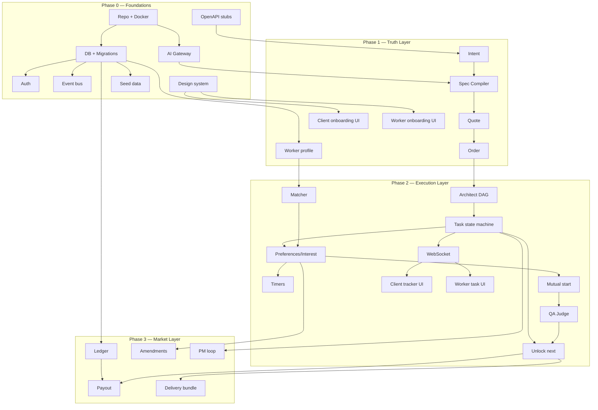
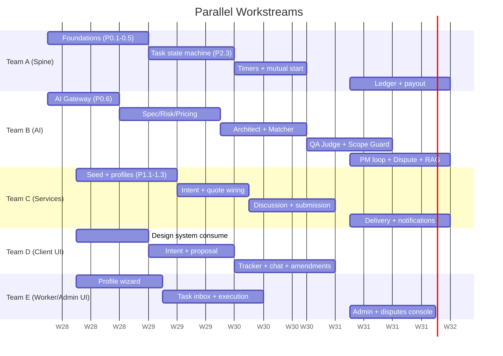

# Project Orchestra — Implementation Plan

> **Purpose:** Divide the entire build into clear, independent pieces with owners, dependencies, and definitions of done — so teams work in parallel without collisions or blocking.
>
> **Companion docs:** `Project_Orchestra_Design_Notes.md` (product model) · `Project_Orchestra_Technical_Spec.md` (databases, APIs, agents)
>
> **Core rule to avoid issues:** *Freeze the interfaces first (DB schema, API contract, event names, AI I/O schemas). Then every piece builds behind its contract and integrates cleanly.*

---

## Table of Contents

1. [How We Avoid Issues (Working Principles)](#1-how-we-avoid-issues-working-principles)
2. [Teams & Roles](#2-teams--roles)
3. [Contracts to Freeze First](#3-contracts-to-freeze-first)
4. [The Work Broken Into Pieces](#4-the-work-broken-into-pieces)
5. [Dependency Map](#5-dependency-map)
6. [Phase Sequencing](#6-phase-sequencing)
7. [Integration Checkpoints & Demo Milestones](#7-integration-checkpoints--demo-milestones)
8. [Parallelization Map (Who Builds What When)](#8-parallelization-map-who-builds-what-when)
9. [Testing Strategy Per Piece](#9-testing-strategy-per-piece)
10. [Definition of Done (Global)](#10-definition-of-done-global)
11. [Risk Register](#11-risk-register)
12. [Hackathon Cut (Compressed Scope)](#12-hackathon-cut-compressed-scope)

---

## 1. How We Avoid Issues (Working Principles)

These six rules prevent the usual team collisions:

1. **Contract-first.** DB schema, OpenAPI spec, event catalog, and AI I/O schemas are written and frozen **before** parallel coding. Changes go through a quick review, not silent edits.
2. **One owner per piece.** Every piece has a single accountable owner. No two people edit the same module boundary.
3. **Pieces talk through contracts, not internals.** Services call each other via API/events, never by reaching into another module's tables.
4. **Mock the neighbours.** Frontend uses a mock API until the real one lands. AI nodes ship with fixture outputs so the Spine can integrate before prompts are perfect.
5. **Vertical slice early.** Build one thin end-to-end path (intent → order → one task → submit → QA → done) before widening. This surfaces integration issues on day one, not week five.
6. **Integration checkpoints.** Fixed points where everything is wired together and demoed. Nothing is "done" until it works in the integrated demo.

---

## 2. Teams & Roles

Mapped to your IIT Delhi Tech + Design communities. Adjust names to real people.

| Team | Focus | Pieces they own |
|------|-------|-----------------|
| **Team A — Spine/Backend Core** | State machine, orders, tasks, events, timers, ledger | P0.x, P2 orchestrator, P5 ledger |
| **Team B — AI/ML** | AI gateway + all 10 Gemini agents, RAG, embeddings | All AI-node pieces |
| **Team C — Backend Services** | Profiles, taxonomy, intent/quote, discussion, submissions, media | Domain service pieces |
| **Team D — Frontend (Client)** | Client portal (intent, proposal, tracker, delivery) | Client UI pieces |
| **Team E — Frontend (Worker/Admin)** | Worker dashboard + admin console | Worker/Admin UI pieces |
| **Design community** | Design system, UX flows, brand, Figma → components | Design system + all screens' UX |

> Small team? Collapse to 3: **Backend (A+C)**, **AI (B)**, **Frontend+Design (D+E+Design)**. The piece boundaries stay identical.

---

## 3. Contracts to Freeze First

**This is Phase 0 and it unblocks everything else. Do this before parallel builds.**

| Contract | What it defines | Owner | Consumers |
|----------|-----------------|-------|-----------|
| **DB schema + migrations** | All tables from Technical Spec §4 | Team A | Everyone |
| **OpenAPI contract** | All endpoints from Spec §7 (request/response shapes) | Team A + C | Frontend, AI |
| **Event catalog** | Event names + payloads from Spec §6 | Team A | All backend |
| **AI I/O schemas** | Pydantic in/out per agent (Spec §8) | Team B | Spine, services |
| **Design tokens + components** | Colors, type, buttons, cards, states | Design | Team D, E |
| **Env + secrets contract** | `.env` keys from Spec §14 | Team A | Everyone |

**Deliverable of Phase 0:** a running skeleton — `docker-compose up` starts API + DB + Redis + MinIO, migrations apply, `/health` responds, auth issues a JWT, and the OpenAPI docs page renders all endpoint stubs (returning mock data).

---

## 4. The Work Broken Into Pieces

Each piece: **ID · name · owner · depends on · definition of done (DoD).**

### Phase 0 — Foundations (unblocks all)

| ID | Piece | Owner | Depends on | DoD |
|----|-------|-------|------------|-----|
| P0.1 | Repo + monorepo structure + docker-compose | A | — | `docker-compose up` runs all services |
| P0.2 | DB schema + Alembic migrations (all tables) | A | P0.1 | Migrations apply clean; ER matches spec |
| P0.3 | Auth (register/login/JWT/refresh/RBAC) | A | P0.2 | Tokens issued; role middleware works |
| P0.4 | OpenAPI contract stubs (all endpoints, mock responses) | A+C | P0.1 | `/docs` shows every endpoint |
| P0.5 | Event bus + outbox + EventLog writer | A | P0.2 | Events persist + publish to Redis |
| P0.6 | AI Gateway skeleton (Gemini client, schema validate, decision log) | B | P0.1 | Can call Gemini, validate, log; fixture mode |
| P0.7 | Design system (tokens + core components) | Design | P0.1 | Buttons, cards, inputs, states in Storybook |
| P0.8 | Seed data (skills, tools, task_types, 1 SKU, ledger accounts) | C | P0.2 | Seed script populates taxonomy |

### Phase 1 — Truth Layer (profiles + intent → quote → order)

| ID | Piece | Owner | Depends on | DoD |
|----|-------|-------|------------|-----|
| P1.1 | Worker profile CRUD + completion % + embedding | C | P0.2, P0.6 | Profile saved; completion computed; vector stored |
| P1.2 | Taxonomy + catalog read APIs | C | P0.8 | Skills/tools/task-types/SKUs served |
| P1.3 | Portfolio + media upload (S3/MinIO, signed URLs, scan hook) | C | P0.2 | Upload works; signed URLs; metadata saved |
| P1.4 | Intent capture API | C | P0.4 | Intent stored; triggers Spec Compiler event |
| P1.5 | **AI: Spec Compiler** | B | P0.6, P1.4 | Intent → valid OutcomeSpec JSON |
| P1.6 | **AI: Risk Classifier** | B | P1.5 | Spec → risk tier + feasibility |
| P1.7 | **AI: Pricing Reasoner** (estimates only) | B | P1.6 | Returns effort estimates + confidence |
| P1.8 | Quote service (deterministic price formula) | A+C | P1.7 | Quote created within SKU band |
| P1.9 | Order service (confirm → OutcomeOrder, freeze spec) | A | P1.8 | Order confirmed; spec frozen; event emitted |
| P1.10 | Client onboarding UI (intent chat → proposal) | D | P0.7, P1.4 | Client can submit intent, see proposal |
| P1.11 | Worker onboarding UI (profile wizard) | E | P0.7, P1.1 | Worker builds profile to ≥70% |
| P1.12 | Admin console v1 (verify workers, view orders) | E | P0.7, P0.3 | Admin verifies campus, lists orders |

### Phase 2 — Execution Layer (DAG → preferences → mutual start → submit → QA)

| ID | Piece | Owner | Depends on | DoD |
|----|-------|-------|------------|-----|
| P2.1 | **AI: Architect** (spec → task DAG) | B | P1.5, P1.9 | Valid acyclic DAG with task_types + criteria |
| P2.2 | Fulfillment plan + tasks + dependencies | A | P2.1 | Tasks created; deps stored; root = READY |
| P2.3 | Task state machine + transitions + guards | A | P0.5, P2.2 | All legal transitions enforced; illegal blocked |
| P2.4 | **AI: Matcher** (retrieve + rerank) | B | P1.1, P2.2 | Ranked shortlist + rationale per task |
| P2.5 | Preference + interest + activation logic | A | P2.3, P2.4 | Client ranks ≥3; parallel interest; priority grant |
| P2.6 | Durable timers (priority window, promote backup) | A | P0.5, P2.5 | Timer fires; backup promoted on expiry |
| P2.7 | Mutual start + Charter freeze | A | P2.5 | Both confirm; charter snapshot; payout reserved |
| P2.8 | **AI: Task Packet Generator** | B | P2.7 | Charter → worker brief + checklist |
| P2.9 | Discussion threads + messages | C | P2.7 | Scoped chat opens post-start |
| P2.10 | **AI: Scope Guard** (message classifier) | B | P2.9 | Flags clarification vs scope-change |
| P2.11 | Submission service (structured upload) | C | P2.7, P1.3 | Deliverable submitted; version tracked |
| P2.12 | **AI: QA Judge** (deterministic + Gemini) | B | P2.11 | Pass/fail + per-criterion evidence + confidence |
| P2.13 | QA→completion→unlock next task (Spine) | A | P2.3, P2.12 | Pass unlocks deps; fail → rework |
| P2.14 | WebSocket live updates | A | P2.3 | Order/task/user channels push state |
| P2.15 | Client tracker UI (milestones, preferences, chat, amendments) | D | P1.10, P2.14 | Client watches progress live |
| P2.16 | Worker task UI (inbox, accept, start, submit, QA feedback) | E | P1.11, P2.14 | Worker executes full task loop |

### Phase 3 — Market Layer (money, disputes, autonomy, notifications)

| ID | Piece | Owner | Depends on | DoD |
|----|-------|-------|------------|-----|
| P3.1 | Ledger service (double-entry) + accounts | A | P0.2 | Balanced entries per transaction |
| P3.2 | Payment authorization (Razorpay sandbox) | A | P3.1 | Funds authorized on order confirm |
| P3.3 | Payout + TDS on QA pass | A | P3.1, P2.13 | Net payout computed; released; logged |
| P3.4 | Delivery bundle + client acceptance | C | P2.13 | Bundle assembled; client accepts; order closed |
| P3.5 | Amendment flow (scope change + reprice + refund math) | A+C | P2.10, P3.1 | Versioned charter; funded delta; partial-value rules |
| P3.6 | Dispute case + **AI: Dispute Triage** | B+C | P0.5 | Evidence bundle → human decision console |
| P3.7 | **AI: PM Control Loop** (cron monitor + replan) | B | P2.3, P2.6 | Detects risk; proposes policy-safe actions |
| P3.8 | Notification engine (in-app + email + cadence) | C | P0.5 | Reminders, escalations, digests fire |
| P3.9 | Worker stats + reputation (task-type specific) | C | P2.13 | Stats update on completion |
| P3.10 | Observability (dashboards, SLA alerts, AI quality) | A+B | P0.5 | Ops can see order health + AI metrics |
| P3.11 | RAG flywheel (successful orders → templates) | B | P1.5, P3.4 | Past projects embedded + retrieved |

---

## 5. Dependency Map

---

## 6. Phase Sequencing

Relative weeks (compress/expand to your real deadline).

| Phase | Weeks | Goal | Exit criteria |
|-------|-------|------|---------------|
| **Phase 0** | Week 1 | Skeleton runs; contracts frozen | `docker-compose up` + all stubs + design system |
| **Phase 1** | Week 2–3 | Profiles + intent→quote→order works | Client gets a real quote; worker profile matchable |
| **Phase 2** | Week 3–5 | Full task lifecycle with AI | One outcome delivered end-to-end in staging |
| **Phase 3** | Week 5–6 | Money, disputes, autonomy | Paid outcome, payout, PM loop live |

> Phases overlap: Phase 2 frontend can start while Phase 1 backend finalizes, because the API contract is frozen in Phase 0.

---

## 7. Integration Checkpoints & Demo Milestones

Nothing is "done" until it works at a checkpoint.

| Checkpoint | When | Must demonstrate |
|------------|------|------------------|
| **C0 — Skeleton** | End Week 1 | Login, empty dashboards, OpenAPI live |
| **C1 — First quote** | End Week 3 | Type intent → AI spec → real quote → confirm order |
| **C2 — Vertical slice** | Mid Week 4 | ONE task: match → accept → mutual start → submit → AI QA → complete |
| **C3 — Full outcome** | End Week 5 | Multi-task DAG delivered end-to-end with handoffs |
| **C4 — Money + demo** | End Week 6 | Funded order → payout → delivery bundle → PM loop visible |

**C2 is the most important checkpoint** — it proves the hardest integration (Spine + AI + both frontends) on a single task before you scale to full DAGs.

---

## 8. Parallelization Map (Who Builds What When)

---

## 9. Testing Strategy Per Piece

| Layer | Test type | Rule |
|-------|-----------|------|
| DB / migrations | Migration up/down + constraint tests | Every table has a test row |
| Services | Unit tests on business logic | Each service method covered |
| State machine | Transition tests (legal + illegal) | Illegal transitions must raise |
| AI nodes | Fixture + golden-set tests | Schema always validates; eval set per agent |
| API | Contract tests vs OpenAPI | Response matches declared schema |
| Events | Idempotency + replay tests | Double-delivery is safe |
| Ledger | Balance invariant tests | Debits == credits always |
| Frontend | Component + E2E (Playwright) on happy path | C2 slice has an E2E test |
| Integration | Checkpoint demo script | Runs the vertical slice automatically |

---

## 10. Definition of Done (Global)

A piece is done when:

1. Code merged behind its frozen contract
2. Unit + contract tests pass in CI
3. Emits/consumes the correct events (if applicable)
4. Writes to EventLog for state changes
5. Works in the integrated checkpoint demo
6. Has no hardcoded secrets; uses env vars
7. Owner has written a 3-line "how to run/test" note

---

## 11. Risk Register

| Risk | Likelihood | Impact | Mitigation |
|------|------------|--------|------------|
| Contract churn mid-build | Medium | High | Freeze in Phase 0; change via review only |
| AI outputs unreliable | High | Medium | Fixture mode + confidence gate + human queue |
| Integration left too late | Medium | High | C2 vertical slice by Week 4 |
| Scope creep (building all 20 gaps now) | High | High | Stick to phases; defer Tier-2+ gaps |
| Payment/legal complexity | Medium | High | Sandbox only for demo; real money post-hackathon |
| Team overlap/collisions | Medium | Medium | One owner per piece; talk via contracts |
| Timers unreliable | Low | High | Durable Redis jobs, never in-memory |

---

## 12. Hackathon Cut (Compressed Scope)

If the Gemini X Prize deadline is tight, build **only this path** and mock the rest:

**Must be real:**
- Auth + one SKU (Launch Studio)
- Intent → Spec Compiler → deterministic quote → order
- Architect DAG (even 3 tasks)
- Matcher shortlist + client picks 3
- Parallel interest + priority window + mutual start
- One task: submit → **QA Judge (Gemini Vision)** → complete → unlock next
- Client tracker + worker task UI (live via WebSocket)

**Mock/stub for demo:**
- Real payments (show "funds held" state only)
- TDS, payouts, refunds math
- Disputes, PM loop, RAG, notifications (email)
- Admin beyond verify

**Demo script (5 min):**
1. Client types intent → sees AI-scoped outcome + price
2. Confirms → AI builds task plan
3. Picks 3 preferred workers → priority cascade shown
4. Worker accepts, mutual start, submits a logo
5. Gemini QA verifies against criteria → next task unlocks
6. Client sees milestone complete on live tracker

This proves **AI-native orchestration** end-to-end — the winning narrative — without building the whole market layer.

---

*Build order: freeze contracts (Phase 0) → truth layer (Phase 1) → execution layer (Phase 2) → market layer (Phase 3). Keep the vertical slice (C2) as your north star.*
