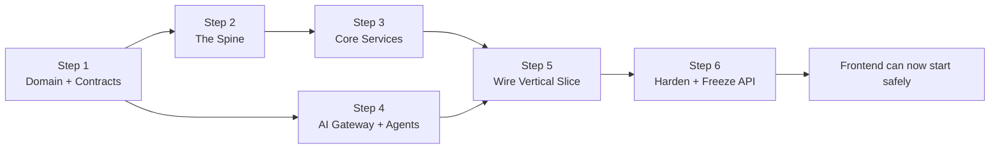

# Project Orchestra — Startup Master Plan

> **What this is:** The single robust plan that ties together the business, the product, and the engineering execution — written from a startup founder's perspective. It absorbs every decision from our design conversations and lays out exactly how we move into the **first prototyping phase, backend-first**.
>
> **Companion docs:**
> - `Project_Orchestra_Design_Notes.md` — product model & decisions
> - `Project_Orchestra_Technical_Spec.md` — databases, APIs, agents, events
> - `Project_Orchestra_Implementation_Plan.md` — engineering pieces & phases
>
> **This doc is the umbrella.** The others are the detail. Read this first.

---

## Table of Contents

**PART I — THE COMPANY**
1. [Vision, Mission & Why Now](#1-vision-mission--why-now)
2. [Problem & Core Insight](#2-problem--core-insight)
3. [The Solution: Outcome-as-a-Service](#3-the-solution-outcome-as-a-service)
4. [Market: TAM / SAM / SOM](#4-market-tam--sam--som)
5. [Competition & Moat](#5-competition--moat)
6. [Business Model & Unit Economics](#6-business-model--unit-economics)
7. [Go-to-Market Strategy](#7-go-to-market-strategy)
8. [Team & Hiring](#8-team--hiring)
9. [Fundraising & Milestones](#9-fundraising--milestones)
10. [Key Metrics (KPIs / OKRs)](#10-key-metrics-kpis--okrs)
11. [Legal, Compliance & Risk](#11-legal-compliance--risk)

**PART II — THE PRODUCT**
12. [Product Roadmap (Prototype → Scale)](#12-product-roadmap-prototype--scale)
13. [Feature Prioritization (MoSCoW)](#13-feature-prioritization-moscow)

**PART III — ENGINEERING EXECUTION (BACKEND-FIRST)**
14. [Engineering Philosophy](#14-engineering-philosophy)
15. [The Backend-First Prototyping Phase (DETAILED)](#15-the-backend-first-prototyping-phase-detailed)
16. [Backend Build Sequence (Step by Step)](#16-backend-build-sequence-step-by-step)
17. [Proving Core Logic Before Frontend](#17-proving-core-logic-before-frontend)
18. [Transition to Frontend](#18-transition-to-frontend)

**PART IV — RUNNING IT**
19. [Team Workstreams & Cadence](#19-team-workstreams--cadence)
20. [Risk Register](#20-risk-register)
21. [Immediate Next Actions](#21-immediate-next-actions)

---

# PART I — THE COMPANY

## 1. Vision, Mission & Why Now

**Vision:** Make executing any digital project as simple as ordering a ride — you state the outcome, it gets delivered.

**Mission:** Build the AI general contractor that turns intent into delivered digital outcomes, staffed by verified talent, verified by AI, and guaranteed by the platform.

**Why now:**
- LLMs (Gemini) are finally capable of **reliable structured reasoning** — scoping, planning, and multimodal QA — which is the missing piece that makes autonomous orchestration possible.
- Post-2024 SMBs and founders expect **fast, packaged, done-for-you** digital work, not freelancer management.
- A huge pool of skilled student talent (IIT Delhi design + tech) is underused and wants fractional income.
- The Gemini X Prize gives us a concrete forcing function and platform to prove it.

---

## 2. Problem & Core Insight

**The problem:** Platforms like Upwork/Fiverr are **directories**, not delivery. For any multi-step project, the buyer becomes the project manager — breaking down tasks, hiring specialists, managing dependencies, and doing QA. This is friction most people hate and many can't do well.

**Core insight:** People don't want to hire freelancers. **They want an outcome.** "Give me a launch-ready brand + website by Friday" — not "manage four contractors for three weeks."

**Why it persists:** Real outcome delivery requires someone to own scoping, coordination, quality, and risk. Humans doing this (agencies) are expensive and don't scale. **AI can now own most of that coordination** — which is the unlock.

---

## 3. The Solution: Outcome-as-a-Service

The client buys a **fixed, verifiable outcome** — clear deliverables, price, deadline, and definition of done. The platform (AI + curated talent) plans, staffs, verifies, and delivers it end-to-end.

**The architecture principle (our biggest technical bet):**
> **Deterministic Spine + AI reasoning nodes.** A reliable state machine owns status, timers, money, and rules. Gemini is called at decision points to scope, match, and judge. **AI proposes; the Spine enforces and records.**

**How it feels:**
- **Client:** describes intent → gets an outcome proposal → confirms → watches milestones → receives delivery.
- **Worker:** builds a machine-readable profile → gets matched → accepts → mutual start → executes task packet → gets paid.
- **AI:** scopes into a DAG, matches talent, monitors, and QA-checks every handoff.

*(Full model in `Project_Orchestra_Design_Notes.md`.)*

---

## 4. Market: TAM / SAM / SOM

> Numbers are **estimates to validate**, framed for narrative — not audited figures.

| Layer | Definition | Rough scale |
|-------|------------|-------------|
| **TAM** | Global freelance + digital services spend | Hundreds of billions USD/yr |
| **SAM** | India SMB + startup digital outcomes (brand, web, apps, AI features) | Multi-billion USD/yr |
| **SOM (24 mo)** | IIT Delhi + Delhi-NCR startups/SMBs buying packaged outcomes | Low crores INR/yr initially |

**Wedge logic:** dominate a tiny, high-trust market (campus + Delhi startups) with one SKU, then expand SKUs and geographies. Small start, venture-scale ceiling.

---

## 5. Competition & Moat

| Competitor type | Examples | Why we differ |
|-----------------|----------|---------------|
| Freelance directories | Upwork, Fiverr | They match; we deliver outcomes |
| Managed talent | Toptal | Human-vetted, expensive, slow; we're AI-orchestrated + faster |
| Agencies | Local studios | Don't scale; we scale via AI coordination |
| AI dev-shop startups | Various 2025-26 "AI agency" tools | Mostly wrappers; we have deterministic ops + verified human delivery |

**Moat (built over time, not day one):**
1. **Data flywheel** — every outcome improves pricing, matching, and QA rubrics.
2. **Outcome templates** — reusable DAGs + acceptance criteria per SKU.
3. **Fulfillment reliability** — on-time %, first-pass QA % that competitors can't match.
4. **Trust graph** — verified talent + reputation specific to task types.
5. **Switching cost** — clients rely on guaranteed delivery; workers rely on steady, managed gigs.

---

## 6. Business Model & Unit Economics

**Model:** fixed-price outcome packages; platform earns the **margin** between client price and internal fulfillment cost (arbitrage on efficient coordination), not a thin directory fee.

**Illustrative unit economics — "Launch Studio" (brand + landing page):**

| Line | Amount (₹, illustrative) |
|------|--------------------------|
| Client outcome price | 12,000 – 15,000 |
| Worker payouts (all tasks) | 7,000 – 9,000 |
| Payment + infra + AI cost | ~800 – 1,200 |
| Rework/refund reserve | ~700 – 1,000 |
| **Gross contribution** | **~2,500 – 4,000 (≈25–30%)** |

**Levers that improve margin over time:**
- Better effort estimation (fewer overruns) via data flywheel
- Higher first-pass QA (less rework)
- Template reuse (less scoping cost)
- **Not** squeezing worker pay — that breaks supply

**Revenue expansion:** more SKUs, repeat clients, higher-value combined outcomes, later a subscription/retainer tier for ongoing needs.

---

## 7. Go-to-Market Strategy

Phased, trust-first, tied to promotion gates (only advance when the prior phase proves on-time delivery at positive margin).

| Phase | Who we sell to | Supply | Proof needed to advance |
|-------|----------------|--------|-------------------------|
| **0. Concierge pilot** | Invited campus founders/fests/alumni | Hand-picked IITD students | 10+ outcomes delivered; failure modes understood |
| **1. Managed campus** | Broader campus demand | Curated campus pool | ≥90% on-time; positive contribution margin |
| **2. Delhi startup wedge** | Verified startups/SMBs | Campus + vetted external | Repeat orders; low dispute rate |
| **3. Vertical expansion** | Selected digital categories | Specialist talent | Each SKU independently profitable |
| **4. Geographic scale** | Broader India | Scaled supply | Ops stable without founder firefighting |

**First customers:** campus startups, societies/fests, professors' ventures, alumni micro-startups. **Distribution:** direct outreach, campus networks, referrals, showcasing delivered outcomes.

---

## 8. Team & Hiring

**Founding roles needed (can be worn by few people early):**
- **Tech/Backend lead** — Spine, core logic, data
- **AI lead** — Gemini agents, QA, matching
- **Product/Ops lead** — fulfillment, talent quality, client success
- **Design lead** — design system, UX, and design-community talent quality

**Talent supply (initial "workforce"):** curated IIT Delhi Design + Tech students, vetted via trial tasks.

**Early hiring priority:** ops/fulfillment manager (the human behind the "human queue") is the first non-founder hire, because early autonomy is low and someone must guarantee delivery.

---

## 9. Fundraising & Milestones

| Stage | Trigger | Use of funds | Milestone to unlock next |
|-------|---------|--------------|--------------------------|
| **Bootstrap** | Now | Build prototype, run campus pilot | 10–30 delivered outcomes + metrics |
| **Pre-seed / Angel / YC** | Proven loop | Ops, talent, small team | Repeatable on-time delivery, early revenue |
| **Seed** | Repeatable + margin | Scale supply/demand, geography | Multi-SKU profitability, retention |

**For YC specifically:** need a working MVP, 10–50 real outcomes, and metrics (on-time %, first-pass QA %, repeat rate, gross margin). Idea is venture-shaped; readiness depends on execution evidence. *(See our earlier assessment.)*

---

## 10. Key Metrics (KPIs / OKRs)

**North-star:** **verified on-time outcome delivery rate** (the promise kept).

| Category | Metric |
|----------|--------|
| Delivery | On-time %, first-pass QA %, avg delivery time |
| Quality | QA pass rate, revision rate, client acceptance rate |
| Economics | Contribution margin/outcome, cost-per-outcome (incl. AI), reserve burn |
| Demand | Intent→quote rate, quote→confirm rate, repeat order rate |
| Supply | Time-to-fill a task, worker on-time %, effective earnings, payout latency |
| AI | Autonomy rate (auto vs human), AI decision accuracy, cost/latency per agent |
| Health | Dispute rate, refund rate, disintermediation attempts detected |

**Stop-sell guardrails:** pause new orders if unstaffed backlog, QA backlog, or refund/rework loss breaches thresholds.

---

## 11. Legal, Compliance & Risk

> Product-architecture notes, **not** legal advice. Validate with Indian counsel + a CA before real money.

| Area | Requirement |
|------|-------------|
| **Entity** | Company registration, founder agreements, IP assignment to company |
| **Contracts** | Client service agreement, worker (independent contractor) agreement, IP chain, NDA, acceptable use, dispute policy |
| **Payments** | Use a licensed partner (e.g. Razorpay Route); don't informally hold funds; KYC/KYB, refunds, chargebacks |
| **Tax** | E-commerce operator TDS (Income Tax Act 2025 §393(1) Sl.8(v), 0.1% on gross, ₹5L threshold for individuals w/ PAN); GST treatment; ledger-grade settlement |
| **Privacy (DPDP 2023 / Rules 2025)** | Data Fiduciary duties: purpose-specific consent, security safeguards (encryption/masking/tokenisation), access/correction/erasure, grievance redressal, breach response |
| **Worker classification** | Avoid excessive control (schedule/methods/exclusivity) that implies employment; design contracts + ops together |
| **AI governance** | No autonomous money/bans/regulated judgments; log model+version; confidence gates |

---

# PART II — THE PRODUCT

## 12. Product Roadmap (Prototype → Scale)

| Stage | Name | Scope | Outcome |
|-------|------|-------|---------|
| **S0** | **Backend Prototype** | Core logic + one vertical slice, no UI | Prove the engine works via tests/API |
| **S1** | **MVP** | One SKU end-to-end + minimal UI | Deliver real outcomes on campus |
| **S2** | **V1** | Payments, disputes, PM loop, 3–5 SKUs | Managed campus market |
| **S3** | **Scale** | Multi-SKU, external demand, autonomy tuning | Delhi startup wedge → beyond |

**We are entering S0 now.** The rest of this document focuses on getting S0 right.

---

## 13. Feature Prioritization (MoSCoW)

**Must (S0/S1):** auth, worker profile, intent→spec→quote→order, DAG, matching, preference+mutual start, submission, QA, task state machine, event log, live tracker.

**Should (V1):** payments/ledger, payout+TDS, delivery bundle, amendments, notifications, disputes.

**Could (later):** PM control loop autonomy, RAG flywheel, reputation depth, multi-worker tasks.

**Won't (now):** L3 regulated outcomes, physical labor, full mobile apps, performance marketing.

---

# PART III — ENGINEERING EXECUTION (BACKEND-FIRST)

## 14. Engineering Philosophy

Four rules that make the build safe and keep the frontend from getting messed up:

1. **Backend-first.** The core logic (Spine + data + services + AI contracts) is built and **proven before any frontend exists**. The frontend is a thin client over a proven API — it can't get "messed up" because the contract is stable and tested first.

2. **Contract-first.** Freeze the interfaces before coding features: **DB schema, OpenAPI, event catalog, AI I/O schemas.** Everything integrates through contracts, never through internals.

3. **Core logic is sacred.** The state machine, event log, and (later) ledger are deterministic, tested, and auditable. AI never mutates state directly. This is where we spend our best engineering effort.

4. **Prove with a vertical slice.** One thin path through the whole system (intent → … → task complete) must run **via automated tests / API calls** before we widen scope or build UI.

> **Why this matters for us specifically:** our value is reliable orchestration. If the core logic is wrong, a pretty frontend hides a broken promise. So we build and prove the engine first.

---

## 15. The Backend-First Prototyping Phase (DETAILED)

This is **Stage S0** — our immediate focus. Goal: **a working backend that can run one full outcome end-to-end through API calls and tests, with no frontend and with AI behind a gateway (fixtures first, then real Gemini).**

### 15.1 What "real" means at S0

Real = the **core logic is genuinely implemented and tested**, not faked:
- Real Postgres tables + migrations
- Real state machine with enforced transitions
- Real event log + durable timers
- Real services (order, task, fulfillment, preference)
- Real API endpoints (contract-accurate)
- AI nodes: **start with fixtures**, then swap to **real Gemini** behind the same schema

Not real yet (deliberately deferred): payments money movement (mock ledger states), frontend, notifications beyond logs, disputes UI.

### 15.2 The single success criterion for S0

> **You can trigger the entire vertical slice from a test script or API client and watch the order go from `intent` to `delivered` with correct state transitions, events, and AI decisions logged — without opening a browser.**

If that passes, the core logic is proven and the frontend can be built safely.

### 15.3 The vertical slice we prove

```text
POST intent
  → Spec Compiler (AI) produces OutcomeSpec
  → Risk Classifier (AI) sets tier
  → Pricing (deterministic) issues Quote
  → confirm Order (spec frozen)
  → Architect (AI) builds task DAG
  → root task READY
  → Matcher (AI) shortlist → set 3 preferences
  → workers accept interest (parallel)
  → priority window → mutual start (charter frozen)
  → submit deliverable
  → QA Judge (AI) pass
  → task completed → next task unlocks
  → all tasks done → delivery bundle → order delivered
```

### 15.4 S0 scope boundaries (to avoid over-building)

- **One SKU:** Launch Studio, but a **3-task DAG** is enough (e.g. logo → UI → landing).
- **One happy path + a few critical edge cases** (priority timeout, QA fail → rework).
- **AI:** Spec Compiler, Architect, Matcher, QA Judge (the 4 that matter). Others stubbed.
- **Money:** ledger **states** only (authorized/reserved/released) — no real gateway.

---

## 16. Backend Build Sequence (Step by Step)

Six ordered steps. Each ends with a concrete, testable artifact. **Do them in order** — later steps depend on earlier ones.

### Step 1 — Domain foundation (contracts + data)
**Build:** repo, docker-compose (Postgres, Redis, MinIO), all SQLAlchemy models, Alembic migrations, seed data (skills, tools, task_types, 1 SKU, ledger accounts), config/env.
**Also freeze:** OpenAPI contract (endpoint stubs), event catalog, AI I/O Pydantic schemas.
**Done when:** `docker-compose up` runs; migrations apply; `/health` + `/docs` respond; seed populates taxonomy.
**Owner:** Backend core. **No AI, no UI.**

### Step 2 — The Spine (core logic — most important)
**Build:** state machine (order + task lifecycles), transition guards (legal vs illegal), event bus + transactional outbox + EventLog writer, durable timers (priority window, auto-accept).
**Done when:** you can drive an order/task through all states **in a unit test**, illegal transitions raise, events persist, a timer fires and promotes a backup.
**Owner:** Backend core. **This is where we invest the most care.**

### Step 3 — Core services (business logic)
**Build:** Auth, Worker Profile (+completion%), Intent, Quote (deterministic pricing), Order (freeze spec), Fulfillment (create DAG tasks + deps), Preference/Interest/Activation, Submission.
**Done when:** each service has unit tests; services emit correct events; no service reaches into another's tables.
**Owner:** Backend services.

### Step 4 — AI gateway + 4 core agents (fixtures → real)
**Build:** AI gateway (Gemini client, schema validation, decision log, confidence gate). Then Spec Compiler, Architect, Matcher, QA Judge — **first returning fixtures**, then wired to real Gemini.
**Done when:** each agent returns schema-valid output; gateway logs decisions; low-confidence routes to a (stub) human queue; swapping fixture↔real needs no caller change.
**Owner:** AI team. **Runs parallel to Steps 2–3 using frozen schemas.**

### Step 5 — Wire the vertical slice (backend integration)
**Build:** connect Spine + services + AI so the full slice (15.3) runs via API/tests. Add WebSocket emission (even if only logged).
**Done when:** an automated test (pytest) or API script executes intent→delivered with correct states, events, and AI logs. **This is the S0 milestone.**
**Owner:** Backend core + AI together.

### Step 6 — Harden + document the API
**Build:** contract tests vs OpenAPI, idempotency/replay tests on events, ledger balance-invariant tests (mock money), fixtures for demo, a "how to run the slice" script.
**Done when:** CI green; API frozen and documented; a new dev can run the slice in one command.
**Owner:** Backend core.



---

## 17. Proving Core Logic Before Frontend

**How we guarantee the frontend won't get messed up:**

1. **The API is frozen and tested first.** Frontend builds against a stable, documented, versioned contract.
2. **The vertical slice passes in CI** without any UI — so we know the logic is correct independent of presentation.
3. **A Postman/pytest collection** demonstrates every endpoint and the full flow. This becomes the frontend's source of truth.
4. **Mock server available** — frontend can develop against the OpenAPI mock even before real backend endpoints are 100% done.
5. **State + events are observable** — the frontend only reflects backend truth; it never owns logic.

**Validation checklist before touching frontend:**
- [ ] All state transitions tested (legal + illegal)
- [ ] Vertical slice runs intent→delivered in CI
- [ ] 4 AI agents return schema-valid outputs (real Gemini)
- [ ] Priority timeout + QA-fail rework paths tested
- [ ] Events logged; timers durable; ledger states balanced (mock)
- [ ] OpenAPI frozen + published

---

## 18. Transition to Frontend

Only after S0 passes:

1. **Design system first** (Design community) — tokens + core components in parallel with S0.
2. **Client portal** — intent chat → proposal → tracker → delivery, wired to the proven API.
3. **Worker dashboard** — profile wizard → task inbox → submit, wired to the proven API.
4. **Admin console** — verify workers, view orders, human queue.
5. **Realtime** — connect WebSocket channels to live-update trackers.

Frontend consumes the **exact** endpoints proven in S0 — no surprises, no rework of core logic.

---

# PART IV — RUNNING IT

## 19. Team Workstreams & Cadence

**Parallel workstreams during S0:**

| Workstream | Owner | S0 focus |
|------------|-------|----------|
| Spine & data | Backend core | Steps 1, 2, 5, 6 |
| Services | Backend services | Step 3 |
| AI | AI team | Step 4 (parallel via frozen schemas) |
| Design system | Design | Tokens + components (for S1) |
| Ops/product | Founder/PM | Define SKU, acceptance criteria, pilot clients |

**Cadence:**
- Daily async standup (what/blockers)
- Twice-weekly integration sync
- End-of-step demo (each build step ends in a shown artifact)
- S0 exit demo: run the vertical slice live via API

## 20. Risk Register

| Risk | Mitigation |
|------|------------|
| Over-building before proving core | Strict S0 scope; one 3-task slice |
| Contract churn | Freeze in Step 1; change via review |
| AI unreliable/slow/expensive | Fixtures first; confidence gates; Flash vs Pro routing; cost budget |
| Integration too late | Vertical slice is the S0 milestone, not an afterthought |
| Frontend rework | API frozen + tested before UI |
| Supply gaps | Capacity-aware selling; recruit talent during S0 |
| Disintermediation | Keep payment + QA + delivery on-platform (design in from S1) |
| Money/legal errors | Mock money in S0; licensed partner + counsel before real money |

## 21. Immediate Next Actions

**This week (start S0, Step 1):**
1. Initialize repo + `docker-compose` (Postgres/pgvector, Redis, MinIO).
2. Implement all SQLAlchemy models + first Alembic migration.
3. Write seed script (skills, tools, task_types, Launch Studio SKU, ledger accounts).
4. Stand up FastAPI with `/health`, auth, and OpenAPI stub endpoints.
5. Freeze v1 of: OpenAPI contract, event catalog, AI I/O schemas.

**Next:** Step 2 (the Spine) — the heart of the product.

**Definition of S0 success:** the vertical slice runs intent→delivered through tests/API, AI decisions logged, no frontend needed.

---

*Backend-first. Contract-first. Prove the core logic, then build the experience on top of a foundation that can't wobble.*
