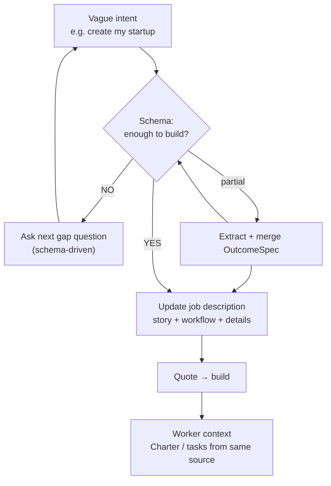
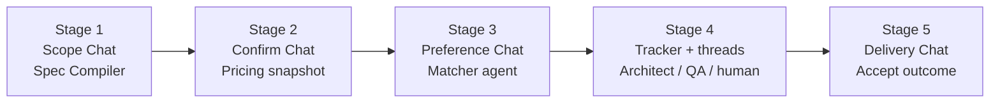
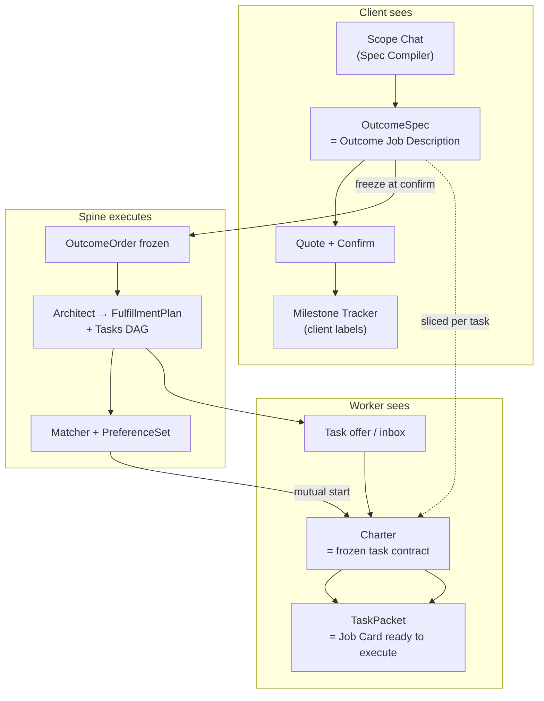

# Interactive Chat Surfaces — Product Architecture

> **North star UX:** Orchestra feels like **Cursor for outcomes** — real-time agent conversations at every decision point. The user talks naturally; we **extract** into our strict schema; the **job description they see is that same JSON rendered human-readably**. One truth, not two documents.
>
> Companion: `docs/SPEC_CO_CREATION.md` (Stage 1 detail)

---

## Core principle — schema asks; job description is what we build

```text
Client says:  "Create my startup"
              ↓
Can we build that?  NO — not enough detail, no clear workflow.
              ↓
JSON schema (OutcomeSpec) = checklist of what MUST be known
              ↓
AI asks ONLY the questions schema says are missing
              ↓
Job description grows: story + deliverables + done-when + workflow
              ↓
That completed description = context for workers (via Charter / tasks)
```

**JSON schema is not the product.** It is the **interrogation engine** — it tells us what important information we still need so we **don't miss anything** (deliverables, acceptance, scope, inputs, workflow steps).

**Job description is the product artifact** — the client reads it; workers build from it. Under the hood it maps to strict `OutcomeSpec` JSON so the Spine can execute. Same truth, two purposes:

| | Purpose |
|---|---------|
| **JSON schema** | Drive questions · validate completeness · power pricing, plan, QA |
| **Job description** | Human story of *what we are actually building* · client approval · worker context |

The client never fills a schema. They talk. We **extract + ask** until the schema is complete enough → the **job description they see is complete enough to build from**.

---

## Example — vague → complete

**Client:** *"Create my startup."*

**System (internal):** schema completeness ~15%. Missing: outcome type, deliverables, acceptance, scope, inputs, workflow.

**Agent (chat):** *"Happy to help. Are you looking for brand only, a landing page, or full launch package? What does your startup do?"*

**Client:** *"HealthTrack — chronic condition tracking. Need brand + landing page, trustworthy."*

**Extract →** partial spec. Schema still missing: company inputs, explicit criteria, out-of-scope boundaries.

**Agent:** *"Got it. I'll scope brand + landing for HealthTrack. Do you have a tagline? Any sites you like for reference?"*

**Panel (job description — not raw JSON):**

> **What we're building:** Launch-ready brand identity and responsive landing page for HealthTrack, a healthcare startup helping people track chronic conditions. Trustworthy, modern tone.
>
> **Deliverables:** Logo (SVG+PNG), brand guide (PDF), Figma UI, live landing URL.
>
> **How we'll verify done:** Logo formats present; mobile Lighthouse ≥70; responsive; visual tone matches healthcare trust rubric.
>
> **Out of scope:** CMS, SEO, content writing, mobile app.
>
> **What we need from you:** Company name ✓, tagline, 2 reference sites.
>
> **Workflow:** Brand direction → Logo → UI design → Build page → Deploy.

That narrative + structure **is** the completed extraction. Workers later get task-level slices of this same context.

---

## Schema-driven extraction loop

The schema defines **what we must know to build**. Chat fills it. Job description shows it.



**Rules:**
1. Never quote or staff until schema completeness passes threshold.
2. Questions come from `missing_fields[]` — not random chat.
3. Job description panel shows **workflow story** + structured sections (not JSON syntax).
4. Worker never starts from vague intent — only from completed description context.

**Client says:** *"Healthcare startup, need brand and landing page, trustworthy feel."*

**We extract (they did not type these):**
- `outcome_statement`, `deliverables[]`, `acceptance_criteria[]`, `in_scope`, `out_of_scope`, `assumptions`, `mapped_task_types`, `risk_tier` …

**We ask only what's still missing:** *"What's the company name? Any reference sites you like?"* → fills `client_inputs_required` / assumptions.

**Panel shows:** human job description — *"Launch-ready brand identity and landing page for HealthTrack… Deliverables: Logo (SVG+PNG)… Out of scope: CMS, SEO…"*

Under the hood: same object as `OutcomeSpec` in Postgres.

---

## The pattern (same everywhere)

Every stage uses one **Chat Surface** component pattern:

```text
┌─────────────────────────────────────────────────────────────┐
│  [Agent · extracting scope… 72% complete]                    │
├──────────────────────────┬──────────────────────────────────┤
│  CONVERSATION            │  JOB DESCRIPTION                  │
│  (natural language)      │  (rendered OutcomeSpec — NOT a    │
│  Agent asks gaps only    │   second document)                │
└──────────────────────────┴──────────────────────────────────┘
```

Like Cursor: chat drives extraction; the artifact panel is **the built thing** — here, the outcome job description **is** the schema instance.

---

## Journey — chat surfaces by stage



| Stage | When | Agent | What client sees | Canonical JSON (same data) |
|-------|------|-------|------------------|----------------------------|
| **1. Scope** | `/start` | **Spec Compiler** | **Job description** (rendered) | `OutcomeSpec` |
| **2. Confirm** | Before order | **Pricing Reasoner** | Quote summary | `Quote` + frozen `OutcomeSpec` |
| **3. Preferences** | Per ready task | **Matcher** | Ranked shortlist cards | `Candidate[]` |
| **4. Execution** | Tracker | Scope Guard + humans | Milestones + threads | `FulfillmentPlan`, `DiscussionThread` |
| **5. Delivery** | Complete | QA summary | Delivery review | `DeliveryBundle` |

Stages **pop open** as the user progresses — not one giant chat forever. Each session has an `agent_type` and `artifact_type`.

---

## Stage 1 in detail — extraction, not interrogation

### Step A — Client speaks once (or a few times)

Agent opens with one question: *"What outcome do you need delivered?"*

No form. No field list. Client gives **intent in plain language**.

### Step B — We extract into schema (client does not)

Spec Compiler runs with **enforced `OutcomeSpec` schema** (Gemini JSON mode + Pydantic validate):

1. Map utterances → fields (`deliverables`, `acceptance_criteria`, …)
2. Infer defaults from SKU template where client was silent
3. Compute `missing_fields[]` against schema rules
4. Merge patch → increment `version`

**Right panel updates** — client sees their **job description** grow: deliverables, done-when criteria, boundaries. They are reading the same object we will freeze and execute.

### Step C — Agent asks only for gaps

Client will **not** volunteer every field. That's expected. Chat continues **only** to fill schema holes:

> "I have deliverables and scope. What's your company name, and do you have a launch date in mind?"

Each answer → another extraction pass → job description panel updates.

### Step D — Tweaks refine the same object

*"More healthcare-trustworthy"* / *"Add Hindi"* → patch `OutcomeSpec` → panel re-renders. Still one object.

### Step E — Quote when schema complete enough

`ready_for_quote: true` when required fields + confidence threshold met. Confirm shows **identical content** to what they watched build — because it **is** the same JSON.

---

## Stage 3 example — Preference chat pops out

On tracker, when a task hits `ready`, a **Matcher chat surface** slides in (drawer / modal / split — like Cursor agent panel):

| Chat | Artifact |
|------|----------|
| "I found 3 designers strong on logo + healthcare. Want me to explain rankings?" | Three `Candidate` cards with score + rationale |
| User: "Why is Rohan #1?" | Agent explains; user drags rank order |
| User: "Confirm these 3" | `PreferenceSet` JSON submitted → Spine `ready → invited` |

Same interaction model as Stage 1 — different agent, different JSON schema.

---

## Stage 4 — Tracker: multiple threads

Order tracker = **dashboard + chat threads**:

- **System thread** — Architect plan ready, milestone completed, QA passed (agent system messages)
- **Task threads** — client ↔ worker (human), Scope Guard flags in background
- Milestone panel updates via **WebSocket** (not poll)

Think: Cursor sidebar with multiple agent/human conversations; main editor = progress + milestones.

---

## Technical contract (all chat surfaces)

### Shared types (`lib/types.ts` — to add)

```typescript
type AgentType = "spec_compiler" | "pricing" | "matcher" | "scope_guard" | "qa_judge" | "system";

interface ChatSession {
  id: string;
  agent_type: AgentType;
  status: "active" | "completed" | "archived";
  ref_type: "intent" | "order" | "task" | "quote";
  ref_id: string;
  artifact_type: "outcome_spec" | "quote" | "candidate_list" | "fulfillment_plan" | "discussion";
  artifact_version: number;
  created_at: string;
}

interface ChatMessage {
  id: string;
  session_id: string;
  role: "user" | "assistant" | "system";
  body: string;
  artifact_version_after?: number;
  created_at: string;
}

// Stream events (SSE / WebSocket)
type ChatStreamEvent =
  | { type: "token"; content: string }
  | { type: "artifact_updated"; artifact: unknown; version: number }
  | { type: "field_filled"; path: string; value: unknown }
  | { type: "agent_status"; status: "thinking" | "extracting_json" | "ready" }
  | { type: "clarification"; questions: string[] }
  | { type: "error"; message: string };
```

### API pattern (every surface)

| Action | Method |
|--------|--------|
| Start session | `POST /chat/sessions` `{ agent_type, ref_type, ref_id? }` |
| Send message | `POST /chat/sessions/{id}/messages` `{ body }` → opens SSE stream |
| Get history + artifact | `GET /chat/sessions/{id}` |
| Finalize step | `POST /chat/sessions/{id}/finalize` → triggers Spine when applicable |

One gateway; agent router picks Spec Compiler vs Matcher vs Scope Guard based on `agent_type`.

---

## AI Gateway rule (production)

```text
1. User message + current artifact JSON → Gemini (JSON schema enforced)
2. Validate response against Pydantic / Zod — reject & retry if invalid
3. Merge patch into artifact; increment version; persist message
4. Stream tokens + artifact_updated events to UI
5. Log full decision to ai_decision_log
```

**Strict JSON is non-negotiable.** Chat is human; artifact panel is machine-verified.

---

## UI component (v0 owns)

`components/chat-surface.tsx` — reusable shell:

- Props: `sessionId`, `agentType`, `artifactRenderer`
- Handles: message list, composer, streaming, artifact panel slot
- Used on: `/start`, preference drawer on `/orders/[id]`, worker task page later

---

## What we have today vs target

| Today | Target |
|-------|--------|
| Static form on `/start` | Scope Chat Surface |
| `/proposal` loads spec cold | Confirm step — artifact already built |
| Preferences = drag UI only | Preference Chat Surface + Matcher |
| Tracker "chat coming soon" | Task threads + system agent messages |
| REST only | SSE/WS on every active session |

---

## Build order

1. **ChatSurface component + Scope session** (Stage 1) — proves the pattern
2. **Gemini Spec Compiler** with strict schema + streaming
3. Wire finalize → Quote (existing Spine path)
4. **Preference Chat Surface** (Stage 3) — Matcher agent
5. **WebSocket tracker** + task discussion threads (Stage 4)

---

## Owner split

| Layer | Owner |
|-------|-------|
| `ChatSurface` UI, artifact renderers per type | **v0** |
| `/chat/sessions/*`, AI gateway, stream, JSON merge | **Cursor** |
| Types, hooks (`useChatSession`, `useChatStream`) | **Cursor** |

---

## Full client architecture — chat to worker job card (NOT forgotten)

The chat is **step 1** of a **document cascade**. Same source of truth; two languages (client outcome vs worker task).



### What the client sees (from chat)

| What | What it actually is |
|------|---------------------|
| **Job description panel** | Human render of **`OutcomeSpec`** — not a separate doc |
| **Quote card** | Priced view of that same frozen spec |
| **Milestone tracker** | Client-language view of plan derived from same spec |

The client never sees raw JSON unless they opt into "developer view." They see the **job description** — which **is** the schema, rendered.

### What the worker gets (derived from same chat, not a separate form)

| Artifact | When | Agent | What it is |
|----------|------|-------|------------|
| **Task in inbox** | Task `invited` | Matcher | Title, payout, deadline, task_type — offer card |
| **Charter** | `mutual_start` | Spine freeze | **Detailed job contract** for ONE task: scope slice, deliverables, acceptance criteria, payout, deadline, out_of_scope — snapshot from OutcomeSpec + Architect |
| **TaskPacket** | `mutual_start` | **Task Packet Generator** (Gemini Flash) | **Job card ready to work**: checklist from acceptance criteria, client inputs, links, dependencies, "what good looks like" |

**The worker job card is not typed separately in chat.** It is **generated from the OutcomeSpec the client built**, split by Architect, frozen in Charter, operationalized in TaskPacket.

```text
Client chat JSON (OutcomeSpec)
        ↓ freeze
OutcomeOrder + FulfillmentPlan (Architect JSON)
        ↓ per task
Charter.snapshot (strict JSON, immutable)
        ↓ mutual start
TaskPacket (checklist + brief + inputs)  ← worker opens this and executes
```

### Dual-view rule (Design Notes §11)

One `FulfillmentTask` in the Spine. Two presentations:

| | Client | Worker |
|---|--------|--------|
| Language | Outcome / milestone | Task / charter / checklist |
| Labels | `taskStatusClientLabel` | `taskStatusWorkerLabel` |
| Failure | Hidden ("In progress") | Rework checklist visible |
| Job detail | OutcomeSpec + milestones | Charter + TaskPacket |

Chat surfaces are **client-first**. Worker surfaces read **downstream artifacts** produced by Spine + Architect + Task Packet Generator — all traceable to the same scoped JSON.

### Chat surfaces by role (complete map)

| Stage | Client chat / UI | Worker chat / UI |
|-------|------------------|------------------|
| Scope | Spec Compiler chat + OutcomeSpec panel | — |
| Confirm | Quote confirm | — |
| Staffing | Matcher chat + candidate panel | Offer in inbox |
| Execute | Scoped discussion (human + Scope Guard) | Same thread + **Job card (Charter + Packet)** |
| QA / delivery | Tracker update + delivery panel | QA feedback on rework |

### Contract gaps to add (`lib/types.ts`)

- [ ] `TaskPacket` — checklist, inputs, rubric summary (Spec §8 Task Packet Generator)
- [ ] Optional: client-facing alias `OutcomeJobDescription` = `OutcomeSpec` in UI copy only

### UI components (v0)

| Component | Audience | Renders |
|-----------|----------|---------|
| `OutcomeSpecPanel` | Client | Live job description from chat |
| `MilestoneTracker` | Client | Plan in outcome language |
| `WorkerJobCard` | Worker | Charter + TaskPacket + actions |
| `ChatSurface` | Both | Reusable shell per stage |

---

## Definition of done (includes worker path)

1. Client co-creates **OutcomeSpec** in chat; panel shows full job description before confirm.
2. Confirm freezes spec; Architect produces plan client sees on tracker.
3. On mutual start, worker opens **Job card** with Charter + generated TaskPacket — content matches what client scoped (sliced per task).
4. Client tracker and worker task page stay in sync via Spine + WebSocket.
