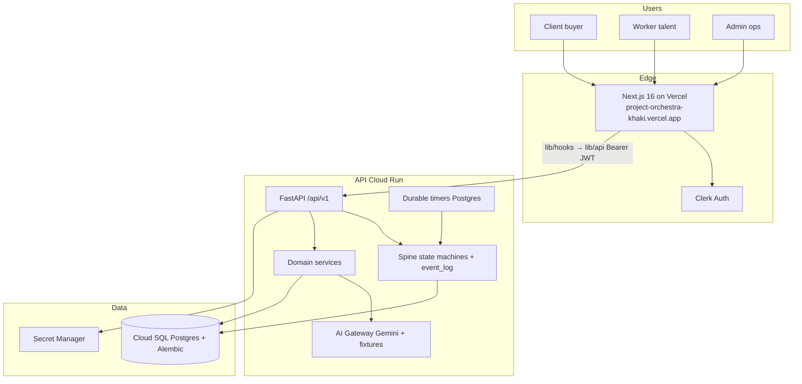
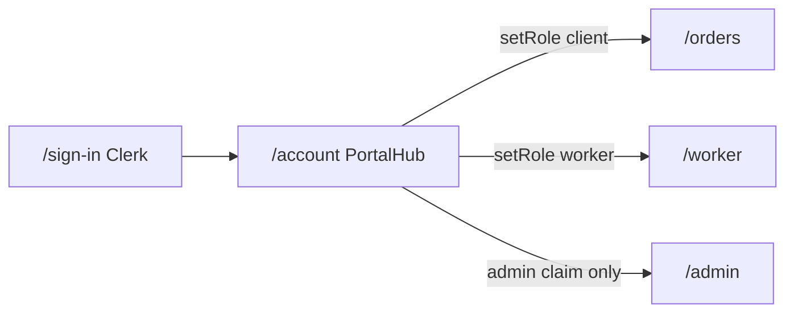
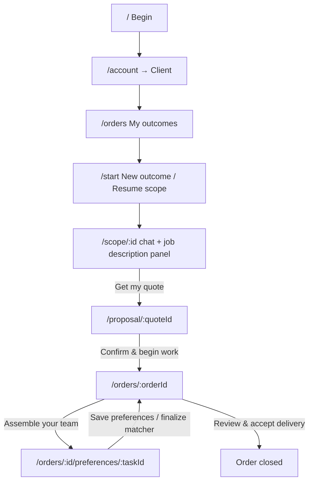
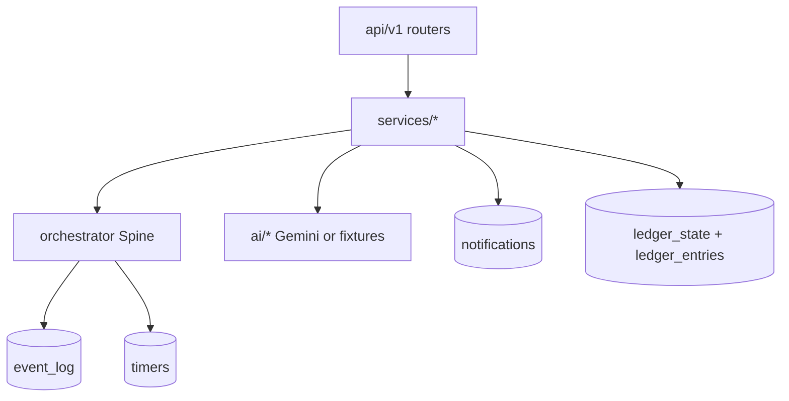

# Project Orchestra — Current Architecture & Progress Guide

> **Audience:** founders, engineers, and partners who need to understand what exists today (not the original aspiration docs alone).
>
> **Live surfaces (2026-07-13):**
> - Frontend: https://project-orchestra-khaki.vercel.app
> - API: https://orchestra-api-979112189932.us-central1.run.app
> - Commit: `1e5107e` on `main` / `core`
>
> **Companions:** [`PIPELINE.md`](PIPELINE.md) (what to build next) · [`UX_WIRING.md`](UX_WIRING.md) (IA) · [`CHAT_SURFACES.md`](CHAT_SURFACES.md) · [`DEPLOY_API.md`](DEPLOY_API.md)

---

## 1. One-paragraph summary (read this first)

Orchestra is an **Outcome-as-a-Service** platform: a buyer describes what they want in natural language; Gemini extracts a strict `OutcomeSpec` (shown as a human job description); after quote confirm, a deterministic **Spine** plans tasks, invites campus talent, runs QA, and delivers. The product has **three portals on one Clerk login** — **client** (buy outcomes), **worker** (do tasks), **admin** (verify talent + audit). The UI never talks to FastAPI directly: screens use hooks in `lib/hooks.ts` → `lib/api.ts` → Cloud Run. AI **proposes** structured JSON; the Spine **enforces** state transitions and writes every change to `event_log`. What we adapted recently includes: role-true RBAC, honest matcher→invite (no fake auto-invite), real in-app notifications, event-driven ledger states (Held→Reserved→Released, still mock money), durable priority timers, workspace UX shell, Amendments from Scope Guard, admin verify + taxonomy, worker stats + media stubs, email/Sentry hooks, payments sandbox (flagged off), disputes + PM tick, and RAG templates from closed orders.

---

## 2. Master system architecture



### Iron rules (unchanged)

1. **Contract-first** — shapes in [`lib/types.ts`](../lib/types.ts) mirror `backend/app/schemas/` (snake_case JSON).
2. **UI never fetches FastAPI directly** — only hooks → `api.ts` (mock swap via `NEXT_PUBLIC_USE_MOCKS`).
3. **AI never mutates state** — Gemini returns JSON; Spine executes transitions.
4. **Every consequential change writes `event_log`** with actor + reason.
5. **Frozen artifacts stay frozen** — OutcomeSpec after confirm, Charter after mutual start; changes only via **Amendment**.
6. **No real money in prod yet** — ledger states + sandbox flag; Razorpay behind `PAYMENTS_ENABLED=false`.

---

## 3. Frameworks & stack (what we actually run)

| Layer | Technology | Role |
|-------|------------|------|
| Frontend | **Next.js 16** (App Router), **React 19**, **TypeScript** | Screens, layouts, SSR/CSR |
| Styling | **Tailwind CSS 4**, design tokens | UI system |
| Motion | **Framer Motion** | Marketing / polish |
| Auth | **Clerk** (`@clerk/nextjs`) | Sign-in/up, JWT to API |
| Data fetching | **TanStack Query** | Hooks, cache, invalidation |
| Validation (FE) | **Zod** | Forms / client checks |
| Backend | **FastAPI** + **Uvicorn** | REST + WebSocket |
| ORM / migrations | **SQLAlchemy 2 async** + **Alembic** | Models, schema evolution |
| DB | **PostgreSQL 16** (Cloud SQL) | Source of truth |
| AI | **google-genai** (Gemini) | Spec, Architect, Packet, QA, Scope Guard |
| Auth verify | **PyJWT** + Clerk JWKS | API RBAC |
| Deploy FE | **Vercel** | Production frontend |
| Deploy BE | **Cloud Run** + Artifact Registry | Production API |
| Secrets | **GCP Secret Manager** | `DATABASE_URL`, `SECRET_KEY`, `GEMINI_API_KEY` |
| CI | **GitHub Actions** | pytest + `tsc` |
| Optional | Resend (email), Sentry, Razorpay sandbox, MinIO/S3 | Feature-flagged / stub-capable |

**Repo lanes:** `main` ≈ UI (`app/**`, `components/**`); `core` ≈ contract + backend (`lib/**`, `backend/**`). Production currently has both merged for deploy.

---

## 4. Three portals — who sees what



| Portal | Who | Home | Backend gate | Can switch via `PATCH /auth/role`? |
|--------|-----|------|--------------|-------------------------------------|
| **Client** | Buyer | `/orders` | `get_current_client` | Yes (↔ worker) |
| **Worker** | Campus talent | `/worker` | `get_current_worker` | Yes (↔ client) |
| **Admin** | Founder / ops | `/admin` | `get_current_admin` | **No** — Clerk `public_metadata` or email allowlist only |

`/auth/me` is the **single source of truth** for effective role. Cross-role API calls return **403**.

---

## 5. UI wiring — shells, screens, primary buttons

### 5.1 Two shells

| Shell | Used on | Contains |
|-------|---------|----------|
| Marketing `Header` | `/`, `/join` | Logo, How it works, Outcomes, FAQ, Join as talent, Begin, AuthNav |
| `WorkspaceHeader` | All authenticated workspace routes | Logo → portal home, role links, **NotificationsBell**, Account, Clerk UserButton |

Workspace layouts that mount `WorkspaceHeader`: `/account`, `/start`, `/scope`, `/proposal`, `/orders`, `/worker`, `/admin`.

### 5.2 Client journey (buttons & screens)



| Screen | Primary CTAs / controls |
|--------|-------------------------|
| `/` | **Begin**, catalog SKU cards, Join as talent |
| `/account` | Portal cards: **Enter client / worker / admin** |
| `/orders` | Open order · **Start new outcome** · Resume drafts |
| `/start` | **Resume scope** (active drafts) · **Start fresh** |
| `/scope/[id]` | Chat send · **Get my quote** · job-description panel live updates |
| `/proposal/[id]` | **Confirm & begin work** · JourneyStepper (quote) |
| `/orders/[id]` | JourneyStepper · **Assemble your team →** · **Review & accept delivery →** · LedgerStrip · Amendment cards · discussion · milestones |
| `/orders/.../preferences/[taskId]` | Rank workers · matcher chat · save preferences |

**JourneyStepper stages (client):** Scope → Quote → Confirm → Team → In progress → Delivery → Accepted (`lib/journey.ts`).

**LedgerStrip:** Held (`funds_authorized`) → Reserved (`milestone_reserved`) → Released (`payout_released`) from API `order.ledger_state`.

### 5.3 Worker journey

| Screen | Primary CTAs / controls |
|--------|-------------------------|
| `/join` | Marketing talent pitch → onboarding |
| `/worker/onboarding` | Profile wizard → save profile (skills, task types, portfolio) |
| `/worker` | Inbox of invited/assigned tasks |
| `/worker/tasks/[id]` | JourneyStepper · **Accept interest** · **Ready to start** · **Submit** · charter/packet · discussion · QA result |

Worker deep links auto-heal role via `setRole('worker')` in worker layout so APIs don't 403.

### 5.4 Admin console

| Area | Controls |
|------|----------|
| Orders | List orders · open `event_log` trail · AI decisions |
| Workers | List · **Verify** / **Unverify** (`campus_verified`) |
| Taxonomy | CRUD skills / tools / task_types / SKUs (admin API) |
| AI quality | Confidence / escalate summary (`/admin/ai-quality`) |
| Disputes | List / resolve (admin dispute routes) |

Matcher **prefers** `campus_verified` workers (falls back if none verified, so demos don't brick).

---

## 6. Backend architecture (Spine + services + AI)



### Core loop (client → delivered)

1. **Scope chat** — Spec Compiler extracts `OutcomeSpec` (SSE stream); RAG templates can seed context from past wins.
2. **Finalize** → quote issued.
3. **Accept quote** → order confirmed · ledger **Held** · Architect builds task DAG.
4. **Preferences** → ranked workers · task `invited` (honest path; accept without prefs → **409**).
5. **Worker accept** → priority window timer · notifications.
6. **Mutual start** → Charter freeze · ledger **Reserved** · Task Packet.
7. **Submit → QA** → pass unlocks next task / fail → rework · `worker_stats` update.
8. **Delivery accept** → order closed · ledger **Released** · RAG template stored.

### AI nodes (propose only)

| Agent | When | Output |
|-------|------|--------|
| Spec Compiler | Scope chat | OutcomeSpec JSON |
| Pricing Reasoner | Pricing chat | Estimates (fixture-capable) |
| Architect | Order confirm | Task DAG |
| Matcher | Candidates / matcher chat | Ranked shortlist |
| Task Packet | Mutual start | Worker brief |
| Scope Guard | Discussion | Flag scope drift → **Amendment draft** |
| QA Judge | Submit | Pass/fail + evidence |

### Platform services adapted this chapter

| Service | Behavior |
|---------|----------|
| Notifications | Projected from `EventWriter.emit` (invite, priority, QA, delivery) |
| Ledger | Lifecycle-driven state + optional double-entry entries |
| Timers | Postgres durable priority window · tick → `promote_backup` |
| Amendments | From scope flag · client approve/reject · charter version bump |
| Email | Resend if key set; else no-op log |
| Payments | Razorpay stub · `PAYMENTS_ENABLED=false` |
| Disputes | Open dispute can block payout release |
| PM tick | `/internal/orchestrator/tick` allowlisted promote/nudge |
| Media | Signed upload URL stub |
| RAG | `project_templates` on close · keyword retrieve into Spec |

---

## 7. Data contract & frontend binding

```text
Screen (app/**, components/**)
    ↓
lib/hooks.ts  (+ lib/admin-hooks.ts)
    ↓
lib/api.ts    (+ lib/admin-api.ts)
    ↓  NEXT_PUBLIC_USE_MOCKS=false
Cloud Run FastAPI /api/v1
```

- **Mocks on** when `NEXT_PUBLIC_USE_MOCKS` is unset/true (v0 / offline).
- **Prod** sets `NEXT_PUBLIC_USE_MOCKS=false` and `NEXT_PUBLIC_API_BASE_URL` to Cloud Run (baked at Vercel build time).

Live updates: WebSocket `/ws/orders/{id}` and `/ws/tasks/{id}` → `lib/live.ts` invalidates queries.

---

## 8. What is shipped vs founder-still-open

### Shipped (code + deployed)

- Full client → worker → delivery loop on live API
- Role-true RBAC (client / worker / admin)
- Honest invite, notifications bell, ledger strip, durable timers
- UX shell: WorkspaceHeader, JourneyStepper, framed Assemble / Accept CTAs, Resume scope
- Amendments, admin verify + taxonomy, worker stats, media stub
- Email/Sentry hooks, payments sandbox (off), disputes, PM tick, RAG templates
- Alembic through `0016_project_templates`
- Vercel production + Cloud Run revision serving traffic

### Founder remaining (ops, not missing features)

1. Run **dual-account prod smoke** (checklist in [`DEPLOY_API.md`](DEPLOY_API.md))
2. Create **Cloud Scheduler** job → `POST /api/v1/internal/timers/tick`
3. Confirm delete leftover **`raysql`** MySQL instance (cost)
4. Keep **`PAYMENTS_ENABLED=false`** until smoke is boringly green

### Explicitly not productized yet

Mobile apps · Redis multi-instance WS fan-out · full TDS · Meilisearch · production Razorpay keys

---

## 9. How to demo in 5 minutes

1. Open https://project-orchestra-khaki.vercel.app → sign in (Clerk).
2. `/account` → **Client** → `/orders` → **New outcome** → chat until **Get my quote** → **Confirm**.
3. Tracker → **Assemble your team** → rank ≥3 workers → save preferences.
4. Second browser / account → `/account` → **Worker** → Accept → Ready → Submit.
5. Client → **Review & accept delivery**.
6. Admin claim account → `/admin` → verify workers / view events.

---

## 10. Doc map (where to go next)

| Want… | Open |
|-------|------|
| What to build next | [`PIPELINE.md`](PIPELINE.md) |
| Screen IA / shells | [`UX_WIRING.md`](UX_WIRING.md) |
| Chat + OutcomeSpec UX | [`CHAT_SURFACES.md`](CHAT_SURFACES.md) / [`SPEC_CO_CREATION.md`](SPEC_CO_CREATION.md) |
| Deploy / smoke / Scheduler | [`DEPLOY_API.md`](DEPLOY_API.md) |
| Original Spec (aspirational detail) | [`../Project_Orchestra_Technical_Spec.md`](../Project_Orchestra_Technical_Spec.md) |
| Agent rules | [`../AGENTS.md`](../AGENTS.md) |

---

*This document reflects the codebase and production deploy as of the campus-ready chapter ship (`1e5107e`). Update it when PIPELINE chapter goals change.*
