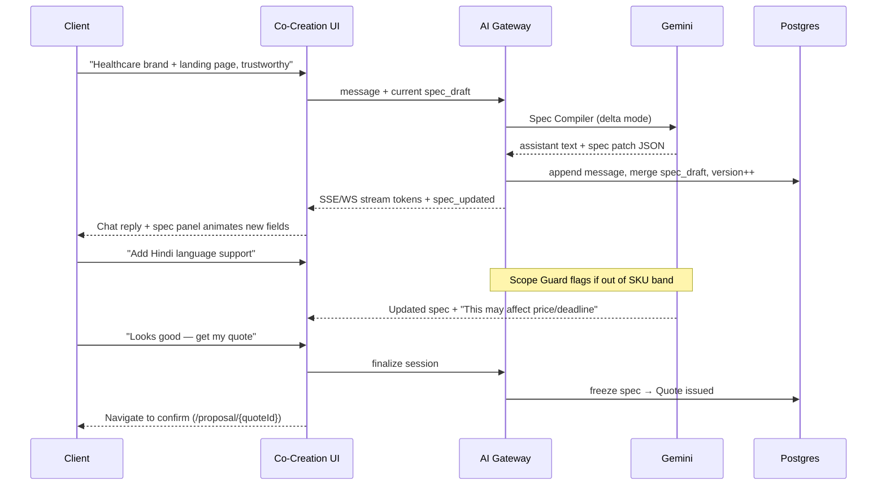

# Spec Co-Creation — Product Architecture (North Star)

> **This is the primary client narrative.** Not a hackathon shortcut. Production path starts here.
>
> **One sentence:** The client scopes their outcome **in real time with Gemini**, watching the `OutcomeSpec` take shape in chat — then confirms price and execution. AI is the interface; the Spine is the engine.
>
> **Full journey (Cursor-like chat at every stage):** see `docs/CHAT_SURFACES.md`.

---

## What we are NOT building

```text
❌ Form → POST /intents → hidden backend job → static /proposal page
❌ "AI runs later" while the user waits on another screen
❌ Fixture JSON pretending to be intelligence
```

That pattern treats AI as a batch processor. **Orchestra treats AI as the product surface for scoping.**

---

## What we ARE building

### The Spec Co-Creation Room

A **split experience** (one route, e.g. `/start` or `/scope/[sessionId]`):

| Left panel | Right panel |
|------------|-------------|
| **Conversation** with Gemini (streaming) | **Live OutcomeSpec** — deliverables, in/out scope, acceptance criteria, assumptions, risk tier |
| Client types naturally; AI asks clarifying questions | Updates **in real time** as each turn completes (not after page navigation) |
| Shows "AI is revising scope…" with streaming tokens | Diff-friendly version counter (`v1`, `v2`, …) before freeze |



---

## Three layers (unchanged iron rules)

| Layer | Role in co-creation |
|-------|---------------------|
| **AI Gateway + Gemini** | Reads message + current draft → returns `{ assistant_message, spec_patch, clarifications?, confidence }` |
| **Spine** | Does **not** run during co-creation. Activates on **finalize** (Quote → Order → tasks) |
| **Domain DB** | `intent_sessions`, `spec_drafts`, `chat_messages` — source of truth for the live session |

**AI proposes spec deltas. Spine enforces only after the client confirms.**

---

## Data model (additions to Technical Spec)

```text
intent_sessions
  id, client_id, status (co_creating | quoted | converted)
  sku_hint, created_at

spec_drafts
  session_id, version, spec_json (OutcomeSpec shape), updated_at

chat_messages
  session_id, role (client | assistant | system), body, spec_version_after, created_at
```

On **finalize**: compile final draft → `outcome_specs` row (frozen) → `quotes` row → client goes to confirmation UI.

---

## Real-time transport

| Phase | Transport | Events |
|-------|-----------|--------|
| Co-creation | **SSE or WebSocket** `session:{id}` | `token`, `spec_updated`, `clarification_needed`, `error` |
| Order tracker | **WebSocket** `order:{id}` | `milestone_updated`, `task_status`, `qa_result` |
| Task discussion | **WebSocket** `task:{id}` | human messages + `scope_flagged` (Scope Guard) |

Co-creation is **not** REST-only. REST bootstraps the session; streaming carries the product feel.

---

## Route map (revised)

| Route | Purpose |
|-------|---------|
| `/` | Marketing |
| `/scope` or `/start` | **Spec Co-Creation Room** (chat + live spec) — primary entry |
| `/proposal/[quoteId]` | Review frozen spec + price + **Confirm & fund** (no surprise content) |
| `/orders/[orderId]` | Live tracker (WebSocket) + human team chat + delivery |
| `/join`, `/worker/*` | Talent side (unchanged) |

Stage 2 `/start` form + instant `/proposal` was **scaffolding**. Next v0 pass refactors `/start` into the Co-Creation Room.

---

## AI agents in this narrative

| Agent | When | Visible to client? |
|-------|------|-------------------|
| **Spec Compiler** | Every co-creation message | **Yes** — chat + spec panel |
| **Risk Classifier** | After significant spec change | Optional inline badge on spec |
| **Pricing Reasoner** | On finalize | Quote card (price/deadline) |
| **Architect** | After order confirm | Milestones on tracker (can show "AI planned 5 tasks") |
| **Scope Guard** | Task discussion messages | Flag on human chat, not co-creation |
| **QA Judge** | Worker submit | Tracker update + delivery panel |

---

## Migration from current build

| Exists today | Action |
|--------------|--------|
| `IntentForm` + `POST /intents` sync fixture | Replace with session + streaming Spec Compiler |
| `/proposal` loads spec from API | Becomes **confirmation** of what client already saw in co-creation |
| `GET /specs/{id}` | Keep for frozen specs post-quote |
| Spine + fulfillment plan | Keep — runs **after** confirm, not during chat |
| Tracker chat placeholder | Becomes **human** scoped chat (separate from co-creation AI) |

---

## Definition of done (production bar)

1. Client opens co-creation room; first AI message greets and asks one smart question.
2. Each client message streams a reply; spec panel updates within the same view (<3s p95).
3. Client sees version history or undo one step (stretch).
4. Finalize produces real Quote; `/proposal` matches what they saw in the panel.
5. Gemini API key required in prod; fixture mode only for CI/offline dev.
6. All spec versions logged to `ai_decision_log` for audit.

---

## Owner split

| Piece | Owner |
|-------|-------|
| Co-Creation UI (split panel, streaming UX) | **v0** |
| Session API, SSE/WS, spec_draft merge, Gemini gateway | **Cursor** |
| Contract types (`IntentSession`, `SpecDraft`, stream events) | **Cursor** (`lib/types.ts`) |
