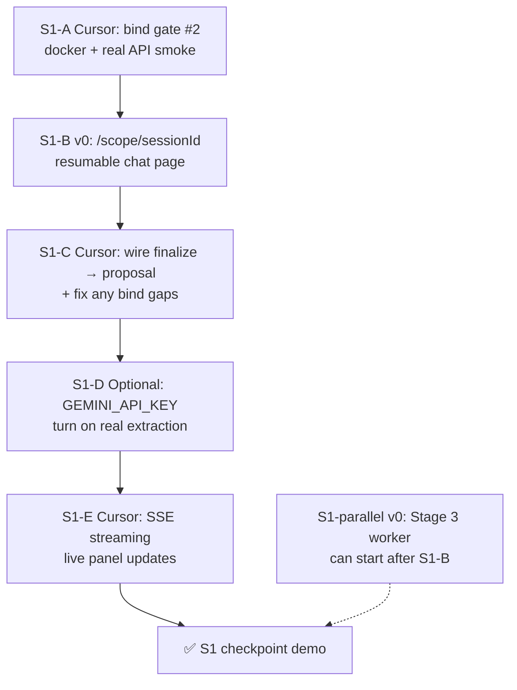

# Sub-plan S1 — Scope Room + Real API Bind

> **Sprint goal:** Client can scope an outcome in a **resumable chat room**, finalize to quote, and complete the **full Stage 2 journey on real Postgres** — demo-able without mocks.
>
> **Parent:** `docs/PIPELINE.md` (N0, N1) · **Architecture:** `docs/CHAT_SURFACES.md`, `docs/SPEC_CO_CREATION.md`
>
> **When S1 is done:** tick boxes here + promote remaining items back to PIPELINE NOW/NEXT.

---

## Outcome (one sentence)

A founder can open `/start`, land in `/scope/{sessionId}`, co-create the job description in chat, click **Get my quote**, confirm on `/proposal`, track on `/orders`, and rank workers — **all against Docker Postgres**, not fixture mocks.

---

## Sequence (what order matters)



**Critical path:** S1-A → S1-B → S1-C → demo. SSE (S1-E) and Stage 3 worker screens can run in parallel once B lands.

---

## Tracks

| Track | Owner | Branch | Paths |
|-------|-------|--------|-------|
| Scope Room UI | **v0** | `main` | `app/**`, `components/**` |
| Bind + streaming + fixes | **cursor** | `core` | `lib/**`, `backend/**` |
| Auth provider + Gemini key | **founder** | — | `.env`, decisions |

---

## S1-A — Bind gate #2 (Cursor) ⟵ **start here**

**Why first:** Proves the chat API + finalize → quote → order chain works on Postgres before v0 builds on top of it.

### Tasks

- [x] `docker compose up -d --build` — API healthy at `localhost:8000/api/v1/health`
- [x] Confirm Alembic runs on boot (`alembic upgrade head` in Dockerfile CMD)
- [x] Frontend `.env.local` (for local browser bind):
  ```env
  NEXT_PUBLIC_USE_MOCKS=false
  NEXT_PUBLIC_API_BASE_URL=http://localhost:8000/api/v1
  ```
- [x] Smoke test — **verified 2026-07-12** (see Runbook below)
- [x] Fix any contract mismatches found — **none required**
- [x] Document runbook snippet in this file

### Done when

- [x] Full API path chat → finalize → quote → spec → order → milestones → candidates → preferences works on Postgres
- [x] `cd backend && python -m pytest` — 14 passed, 3 skipped
- [ ] Browser bind with `USE_MOCKS=false` (founder: run `npm run dev` + `.env.local` locally, or point Vercel at deployed API)

### Runbook (verified)

```powershell
# Prerequisites: docker compose up -d --build
$base = "http://localhost:8000/api/v1"

Invoke-RestMethod "$base/health"                    # → status: ok

$start = Invoke-RestMethod -Method POST "$base/chat/sessions"
$sid = $start.id

Invoke-RestMethod -Method POST "$base/chat/sessions/$sid/messages" `
  -ContentType "application/json" -Body '{"body":"create my startup"}'
# → ready_for_quote: false

Invoke-RestMethod -Method POST "$base/chat/sessions/$sid/messages" `
  -ContentType "application/json" `
  -Body '{"body":"HealthTrack — brand + landing, healthcare tone. Tagline: Your health, tracked. References: apple.com"}'
# → ready_for_quote: true, completeness_pct: 100

$fin = Invoke-RestMethod -Method POST "$base/chat/sessions/$sid/finalize"
# → intent_id, quote_id

$quote = Invoke-RestMethod "$base/quotes/$($fin.quote_id)"
$spec = Invoke-RestMethod "$base/specs/$($quote.spec_id)"

$accept = Invoke-RestMethod -Method POST "$base/quotes/$($fin.quote_id)/accept"
Invoke-RestMethod "$base/orders/$($accept.order_id)/milestones"
# → tasks: 5, milestones: 3
```

**Browser:** `npm run dev` with `.env.local` above → `/start` → `/scope/{id}` → chat → Get my quote → `/proposal/{quoteId}` → confirm → tracker → preferences.

### Estimate

~1 session (2–4 hours)

---

## S1-B — Dedicated scope page (v0)

**Why:** Chat on `/start` loses state on refresh. Production UX needs a session URL.

### Tasks

- [x] **NEW** `app/scope/[sessionId]/page.tsx` — hosts `ScopeChatSurface` + `JobDescriptionPanel` *(v0, main c3ab130)*
- [x] **UPDATE** `app/start/page.tsx` — redirect to `/scope/${session.id}` *(v0)*
- [x] Load session via `useChatSession(sessionId)` — loading + error states *(v0)*
- [x] Finalize → `/proposal/${quote_id}` *(v0)*
- [x] UX: pending send, completeness bar, Get my quote gating *(v0)*

### Done when

- [x] Refresh `/scope/{id}` resumes the same conversation + draft
- [x] Shareable URL works (same session id)
- [x] Finalize lands on proposal page
- [x] Live on Vercel (mocks by default until bind gate)

### Estimate

~1 v0 session

### Ready-to-paste v0 prompt

```
Build the dedicated Scope Co-Creation Room for Project Orchestra.

Context: Stage 2 client flow is on main. Cursor added ScopeChatSurface +
JobDescriptionPanel on /start and chat hooks in @/lib/hooks. Your job is a
resumable session page — do NOT edit lib/**.

Golden rules: @/lib/types, @/lib/hooks only, design tokens, app/** + components/**.

1) NEW app/scope/[sessionId]/page.tsx
   - useChatSession(sessionId) for load; skeleton while loading; friendly 404 if missing
   - Render ScopeChatSurface (or extract a presentational ChatSurface) + JobDescriptionPanel
   - useSendChatMessage(sessionId), useFinalizeChatSession()
   - On finalize success: router.push(`/proposal/${quote_id}`) from FinalizeChatSessionResult
   - Get my quote button disabled unless session.ready_for_quote

2) UPDATE app/start/page.tsx
   - On mount: useStartScopeSession() → router.replace(`/scope/${data.id}`)
   - Keep minimal marketing copy above the redirect (or instant redirect with spinner)

3) UX
   - Pending state on send message
   - Completeness % visible
   - lg: two-column chat + job description; sm: stacked

Match indigo Lumena aesthetic. TypeScript clean. Mock + real API both work via hooks.
```

---

## S1-C — Post-bind fixes (Cursor)

**Why:** v0 finalize navigation and real API often surface small contract gaps.

### Tasks

- [x] Ensure `FinalizeChatOut` / hooks expose `quote_id` — verified (`FinalizeChatOut` + scope page uses `result.quote_id`)
- [x] Proposal page: `useQuote` + `useSpec(quote.spec_id)` — verified against real finalize output
- [x] No contract fixes required
- [x] Runbook added to this file (S1-A)
- [ ] Merge `core` → PR to `main` if doc-only updates needed

### Done when

- [x] v0 scope page → proposal → order path verified on real API (REST smoke)

### Estimate

~0.5 session (often bundled with S1-A)

---

## S1-D — Turn on Gemini (Founder + Cursor) — optional this sprint

**Blocked on:** founder adds `GEMINI_API_KEY` to `.env` / Docker env.

### Tasks

- [ ] Founder: add key to local `.env` and/or Docker `api` service environment
- [ ] Cursor: smoke one scope chat turn — confirm `ai_decision_log.source = 'gemini'`
- [ ] Compare extraction quality vs fixture on 2–3 test prompts (food app, fintech, healthcare)

### Done when

- [ ] Non-template outcomes extract correctly (not only Launch Studio keywords)

### Estimate

~30 min once key is available

---

## S1-E — SSE streaming (Cursor) ✅

**Why:** North star UX — panel updates as tokens arrive.

### Tasks

- [x] Backend: `POST /chat/sessions/{id}/messages/stream` (SSE)
- [x] Event types: `token`, `draft_patch`, `turn_complete`, `error` in `lib/types.ts`
- [x] Fixture streams reply chunks; Gemini path can extend gateway later
- [x] `chatApi.sendMessageStream` + `useSendChatMessage` with `streamingText`
- [x] `/scope/[sessionId]` shows streaming assistant bubble + live draft panel patch

### Done when

- [x] User sees assistant text stream; job description panel updates on `draft_patch`

### Estimate

~1–2 sessions — **defer if S1-A/B/C not done**

---

## S1-parallel — Stage 3 worker (v0, after S1-B)

Can start once scope page is merged — no dependency on SSE or Gemini key.

See **`docs/V0_HANDOFF.md`** Stage 3 prompt (`/join`, `/worker/onboarding`, `/worker`, `/worker/tasks/[taskId]`).

### Done when

- [ ] Worker journey clickable on mocks (Rohan Verma scenario)

---

## Founder decisions (unblock later work)

| Decision | Blocks | Default if no answer |
|----------|--------|---------------------|
| Auth provider (Clerk / Auth.js / custom JWT) | Production multi-user, real session ownership | Keep demo client stub through S1 |
| `GEMINI_API_KEY` | Real AI extraction | Fixture fallback (works for demo) |
| Merge policy: `core` → `main` PR for lib fixes during S1 | v0 using latest hooks | Single PR after S1-C |

---

## Demo script (S1 checkpoint — ~5 min)

1. Open `/start` → redirects to `/scope/{id}`
2. Say: *"create my startup"* → AI asks clarifying questions; panel ~low completeness
3. Say: *"HealthTrack — brand + landing, healthcare tone, tagline: Your health tracked"* → panel fills; **Get my quote** enables
4. Finalize → `/proposal/{quoteId}` — price + spec visible
5. Confirm → `/orders/{orderId}` — milestones visible
6. Open preferences on a ready task → rank 3 workers → back to tracker

**Say out loud:** *"Job description and JSON are the same truth — chat extracted it; workers will build from this."*

---

## Checklist summary

| ID | Task | Owner | Status |
|----|------|-------|--------|
| S1-A | Bind gate #2 — Docker + real API | cursor | [x] API smoke verified 2026-07-12 |
| S1-B | `/scope/[sessionId]` page | v0 | [x] shipped `main` c3ab130 |
| S1-C | Finalize → proposal bind fixes | cursor | [x] no fixes needed |
| S1-D | Gemini key live | founder + cursor | [ ] optional |
| S1-E | SSE streaming | cursor | [x] stream endpoint + hook + scope page |
| S1-P | Stage 3 worker screens | v0 | [ ] parallel |

---

## After S1

Promote to PIPELINE NOW:

- **N0** tick: resumable page, bind gate (if SSE deferred, keep SSE in NOW)
- **N1** tick: bind gate #2 complete
- **N3** move Stage 3 worker to active NOW if not already shipped
- **NEXT:** JWT auth (X1), Matcher agent (preference chat), B2 integration tests (N2)

Delete or archive this sub-plan when all required rows (A, B, C) are checked.
