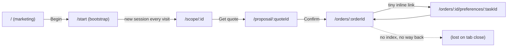
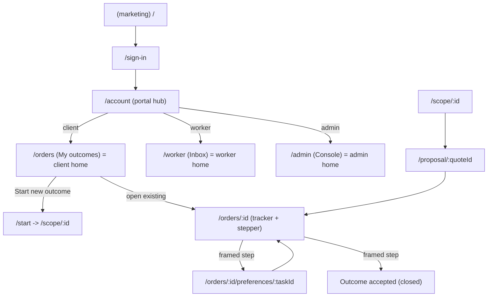
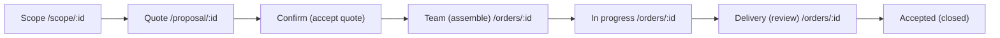

# UX Wiring Framework (client / worker / admin)

> How the screens connect into one coherent product. This is the information
> architecture + journey model that every screen must obey. Pairs with
> `docs/PIPELINE.md` (what to build) and `docs/CHAT_SURFACES.md` (chat UX).
>
> **Ownership:** the IA + contracts here are the Cursor lane (`lib/**`, `backend/**`, `docs/**`).
> The screens/app-shell that realize it are v0's lane (`app/**`, `components/**`) — see the
> ready-to-paste handoff at the end.

---

## 1. The problem this fixes

Today the screens are islands stitched by `router.push`:

- Every screen renders the **marketing** `components/header.tsx` (How it works / Outcomes / FAQ / Begin), even inside a live order or the worker inbox.
- There is **no client re-entry point** — no `/orders` list. Order IDs are stashed in `sessionStorage` and never read back, so closing the tab loses the order. The client "home" (`/start`) only ever starts a *new* scope.
- There is **no visible journey model** — the client can't see where they are (Scope -> Quote -> Confirm -> Team -> In progress -> Delivery -> Accepted).
- The **"pick your team"** and **"accept delivery"** steps are buried (a tiny inline link, a card at the bottom of the tracker).



---

## 2. Information architecture (to-be)

Two zones: a public **marketing** zone and an authenticated **workspace** zone with three portals. Portal is the user's active role (`GET /auth/me`), enforced server-side (see `docs/PIPELINE.md` role model).

| Zone | Routes | Shell | Gate |
|------|--------|-------|------|
| Marketing | `/`, `/join`, `/sign-in`, `/sign-up` | `Header` (marketing) | public |
| Account | `/account` | `WorkspaceHeader` | signed in |
| Client portal | `/orders` (home), `/orders/[id]`, `/orders/[id]/preferences/[taskId]`, `/start`, `/scope/[id]`, `/proposal/[quoteId]` | `WorkspaceHeader` (client) | role `client` |
| Worker portal | `/worker` (home), `/worker/tasks/[id]`, `/worker/onboarding` | `WorkspaceHeader` (worker) | role `worker` |
| Admin portal | `/admin` (home) | `WorkspaceHeader` (admin) | role `admin` |



**Canonical home per portal** (portal hub routes here, and `WorkspaceHeader` logo links here):

- client -> `/orders`
- worker -> `/worker`
- admin -> `/admin`

---

## 3. The two app shells

### 3a. Marketing `Header` (existing)
Home + talent landing only. Logo, section anchors, "Join as talent", "Begin", `AuthNav`.

### 3b. `WorkspaceHeader` (new — v0)
Used by every authenticated workspace screen. Portal-aware:

- Logo -> the active portal's home (not `/`).
- Primary link(s): client = "My outcomes" (`/orders`) + "New outcome" (`/start`); worker = "Inbox" (`/worker`); admin = "Console" (`/admin`).
- Right side: "Account" (`/account`, the portal switcher) + Clerk `UserButton` / sign-out.
- Never shows marketing "Begin" or section anchors.

Rule: **no screen inside the workspace zone renders the marketing `Header`.** Screens get the shell from their portal `layout.tsx`, not by importing `Header` directly.

---

## 4. Journey model (the stepper)

A persistent `JourneyStepper` renders the same stage bar across the client workflow so the user always sees where they are and what's next. Stages come from `lib/journey.ts` (contract-driven, not hardcoded in screens).

### Client journey
Stages: `Scope -> Quote -> Confirm -> Team -> In progress -> Delivery -> Accepted`.



Order-screen stage is derived from `OrderStatus`:

| OrderStatus | Stepper stage |
|-------------|---------------|
| `confirmed`, `assembling_team` | Team |
| `delivery_active`, `under_quality_check`, `amendment_pending`, `escalated` | In progress |
| `delivered` | Delivery |
| `closed` | Accepted |
| `cancelled` | (terminal — cancelled) |

Pre-order screens pass their own stage: `/scope` -> `Scope`, `/proposal` -> `Quote`.

### Worker journey
Stages: `Invited -> Accepted -> In progress -> QA -> Completed`, derived from `TaskStatus`:

| TaskStatus | Stepper stage |
|------------|---------------|
| `ready`, `invited`, `interest_pool` | Invited |
| `priority_active`, `start_requested`, `mutual_start` | Accepted |
| `in_progress`, `rework` | In progress |
| `submitted` | QA |
| `completed`, `released` | Completed |

Client-facing labels stay in `lib/state-labels.ts` (`orderStatusClientLabel`, `taskStatusClientLabel`); the stepper stage grouping lives in `lib/journey.ts`. Never show worker failure states (`rework`) to the client — it maps to "In progress".

---

## 5. Screen inventory (route / purpose / entry / exit / data / gate)

### Client
- `/orders` — **My outcomes (home).** Entry: portal hub, `WorkspaceHeader` logo. Exit: open an order -> `/orders/[id]`; "New outcome" -> `/start`. Data: `useMyOrders`. Gate: client. States: empty ("Start your first outcome"), list.
- `/start` — **Start scope.** Entry: `/orders` CTA, header "New outcome". Exit: auto-create session -> `/scope/[id]`. Data: `useStartScopeSession`. Note: should reuse an open draft if one exists (see stretch) instead of always creating new.
- `/scope/[sessionId]` — **Scope chat + live spec.** Stepper: Scope. Exit: "Get my quote" -> `/proposal/[quoteId]`. Data: `useChatSession`, `useSendChatMessage`, `useFinalizeChatSession`.
- `/proposal/[quoteId]` — **Proposal + price + pricing chat.** Stepper: Quote. Exit: "Confirm & begin" -> `/orders/[orderId]`. Data: `useQuote`, `useSpec`, `useAcceptQuote`, pricing chat hooks.
- `/orders/[orderId]` — **Tracker.** Stepper: Team/In progress/Delivery/Accepted (from status). Framed steps: "Assemble your team" (when a task is `ready`/`invited`) and "Accept delivery" (when `delivered`). Data: `useOrder`, `usePlan`, `useDelivery`, `useDiscussion`, `useAcceptDelivery`, `useMe`.
- `/orders/[orderId]/preferences/[taskId]` — **Assemble team.** Entry: framed CTA on tracker. Exit: confirm -> `/orders/[orderId]`. Data: `useCandidates`, matcher chat hooks, `useSetPreferences`.

### Worker
- `/worker` — **Inbox (home).** Data: `useWorkerProfile`, `useMyTasks`, `useNotifications`. Exit: open task -> `/worker/tasks/[id]`; low profile -> `/worker/onboarding`.
- `/worker/onboarding` — **Profile wizard.** Exit: >=70% -> `/worker`. Data: `useSaveWorkerProfile`. (Role auto-set by `app/worker/layout.tsx`.)
- `/worker/tasks/[taskId]` — **Job card.** Stepper: worker stages. Data: `useCharter`, `useTaskPacket`, `useMyTasks`, `useDiscussion`, `useAcceptInterest`, `useReadyToStart`, `useSubmit`, `useTaskQA`.

### Admin
- `/admin` — **Console (home, read-only).** Data: `useAdminOrders`, order events, AI decisions. Gate: admin.

---

## 6. Wiring conventions (make them consistent)

1. **Route-addressable state only.** Never hand off via `sessionStorage`. The URL param (`sessionId`/`quoteId`/`orderId`/`taskId`) is the source of truth; dashboards (`/orders`, `/worker`, `/admin`) are always-available re-entry points. Remove the `sessionStorage.setItem("intent_id"/"order_id")` writes in `/scope` and `/proposal` (dead — nothing reads them).
2. **Every workspace screen has an "up" path** via `WorkspaceHeader` (portal home) — no dead ends. Error/empty states link to the portal home, not just "start new".
3. **Framed steps, not buried links.** When the order needs the client (`ready`/`invited` task, or `delivered`), the tracker shows a prominent primary CTA ("Assemble your team", "Accept delivery"), plus the stepper highlights that stage.
4. **Loading / empty / error are first-class.** Loading = skeleton or "Loading..."; empty = actionable ("Start your first outcome"); error = message + link to portal home.
5. **Stepper everywhere in a flow.** `/scope`, `/proposal`, `/orders/[id]` render `JourneyStepper` with the current stage.

---

## 7. Contract glue this framework depends on (Cursor lane)

Delivered alongside this doc:

- `GET /api/v1/orders` — list the current client's orders (newest first), scoped by `client_id`. Response: `OutcomeOrderOut[]`. (`backend/app/api/v1/orders.py`)
- `clientApi.listOrders()` + `useMyOrders()` — contract hook for the `/orders` dashboard. (`lib/api.ts`, `lib/hooks.ts`, mock in `lib/mock-data.ts`)
- `lib/journey.ts` — `CLIENT_JOURNEY_STAGES`, `WORKER_JOURNEY_STAGES`, and `clientStageForOrder(status)` / `workerStageForTask(status)` so the stepper is contract-driven.
- `GET /api/v1/chat/sessions` — the client's active scope drafts (newest first), exposed as `chatApi.listScopes()` + `useMyScopes()`, so `/start` can offer "Resume scope" instead of spawning orphaned sessions. (`backend/app/api/v1/chat.py`, `lib/api.ts`, `lib/hooks.ts`)

---

## 8. Ready-to-paste v0 handoff prompt

> Paste into v0. It builds the app-shell + screens in `app/**` and `components/**`,
> wiring to existing hooks. It must NOT edit `lib/**` or `backend/**`.

```text
Build the Project Orchestra "workspace shell + navigation" pass. Wire to existing
hooks in @/lib/hooks and types in @/lib/types ONLY — do NOT edit lib/** or backend/**.
Use design tokens (bg-background, text-primary, border-border, text-muted-foreground);
light + dark must both work. Client and worker screens already exist — you are adding
the shell, the dashboard, and the stepper, and reframing two steps.

1) NEW components/workspace-header.tsx
   - Portal-aware top nav for authenticated screens. Read role via useMe().
   - Logo links to the active portal home: client -> /orders, worker -> /worker, admin -> /admin.
   - Links: client = "My outcomes" (/orders) + "New outcome" (/start); worker = "Inbox" (/worker);
     admin = "Console" (/admin). Always show "Account" (/account) + Clerk <UserButton/>.
   - Never show marketing "Begin" or section anchors.

2) NEW layouts hosting the shell (client component wrappers, render <WorkspaceHeader/> + children + <Footer/>):
   - app/orders/layout.tsx, app/start/layout.tsx, app/scope/layout.tsx, app/proposal/layout.tsx
     (client zone), app/admin/layout.tsx (admin). app/worker/layout.tsx exists (role guard) — add the
     WorkspaceHeader there too. Replace the marketing <Header/> currently imported inside these screens.

3) NEW app/orders/page.tsx — client dashboard "My outcomes" (this becomes the client home)
   - useMyOrders(); grid/list of orders: outcome title (or order id), orderStatusClientLabel[status],
     progress_pct bar, price, deadline. Click -> /orders/[id].
   - Empty state: "Start your first outcome" -> /start. Primary CTA "New outcome" -> /start.

4) NEW components/journey-stepper.tsx
   - Horizontal stepper. Props: stages (from CLIENT_JOURNEY_STAGES / WORKER_JOURNEY_STAGES in
     @/lib/journey) and a currentStageId. Highlight done/current/upcoming.
   - Render it on /scope (stage "scope"), /proposal (stage "quote"), and /orders/[id]
     (clientStageForOrder(order.status)). On /worker/tasks/[id] use workerStageForTask(task.status).

5) REFRAME app/orders/[orderId]/page.tsx (wiring only, keep the visual system)
   - Add <JourneyStepper/> at the top.
   - When any task.status is "ready" or "invited": show a prominent primary CTA card
     "Assemble your team ->" linking to /orders/[id]/preferences/[firstSuchTaskId]
     (not just the tiny inline link).
   - When order.status === "delivered": show a prominent "Review & accept delivery" CTA that scrolls to
     / expands the deliverables + acceptDelivery action.

6) Portal hub (components/portal-hub.tsx) already routes client -> /start. Change client home to /orders.

7) OPTIONAL app/start/page.tsx — before creating a new session, call useMyScopes(). If active drafts
   exist, offer "Resume scope" (link each to /scope/[id]) alongside "Start fresh". Kills orphaned sessions.

Do not add auth pages. Do not edit lib/** or backend/**. Reuse existing screens' components and tokens.
```

---

## 9. Status

- [x] Framework + IA + journey model + v0 handoff (this doc)
- [x] Contract glue: `GET /orders` + `useMyOrders`, `lib/journey.ts`, resume-scope (`GET /chat/sessions` + `useMyScopes`) — tests green, `tsc --noEmit` clean
- [x] v0: WorkspaceHeader + layouts + `/orders` dashboard + JourneyStepper (scope/proposal/order/worker task) + reframed Assemble/Accept CTAs + Resume scope on `/start` (Plan E, 2026-07-13)
